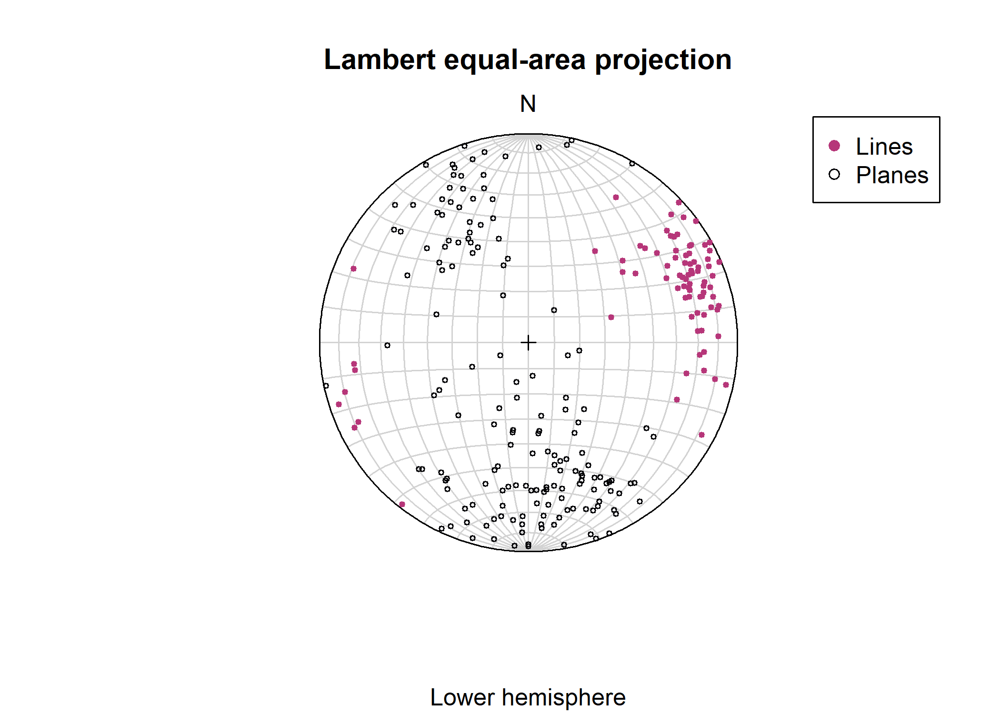

<!-- README.md is generated from README.Rmd. Please edit that file -->

# structr

<!-- badges: start -->

[](https://github.com/tobiste/structR/actions/workflows/R-CMD-check.yaml)

<!-- badges: end -->

`{structur}` is a free and open-source package for R that provides tools
for structural geology. You can

- analyze and visualize orientation data of structural geology
  (including, stereographic projecitons, contouring, fabric plots, and
  statistics.)

- analyze stress (including visualization of the magnitudes of stress in
  the Mohr circle and extracting the maximum horizontal stress of a 3D
  stress tensor)

- reconstruct the orientation of structures in oriented drill cores
  using the alpha, beta, and gamma angles

- calculate fault displacement components

## Installation

You can install the development version of `{structr}` from
[GitHub](https://github.com/) with:

``` r
# install.packages("devtools")
devtools::install_github("tobiste/structr")
```

## Example

This is a basic example which shows you how to import data and plot them
on a sterographic projection.

``` r
library(structr)
library(ggplot2)

data(example_planes)
planes <- Plane(example_planes$dipdir, example_planes$dip)

fabric_strength <- fabric_indexes(planes)

ggstereo() +
  geom_contourf_stereo(gg(planes), show.legend = TRUE) +
  geom_point(data = gg(planes), aes(x, y), color = "lightgrey", shape = 21) +
  scale_fill_viridis_d(option = "A") +
  labs(
    subtitle = "Example data",
    title = "Density contour plot",
    fill = "Multiples of\nvon Mises-Fisher\ndistribution",
    caption = paste0("Equal area, lower hemisphere projection | Fabric strength: ", round(fabric_strength["C"], 2))
  )
```



## Documentation

The detailed documentation can be found at
<https://tobiste.github.io/structr/>

## Author

Tobias Stephan (<tstephan@lakeheadu.ca>)

## Feedback, issues, and contributions

I welcome feedback, suggestions, issues, and contributions! If you have
found a bug, please file it
[here](https://github.com/tobiste/geoprofiler/issues) with minimal code
to reproduce the issue.

## License

MIT License
