<!-- README.md is generated from README.Rmd. Please edit that file -->

# structr

<!-- badges: start -->

[](https://github.com/tobiste/structr/actions/workflows/R-CMD-check.yaml)

<!-- badges: end -->

`{structr}` is a free and open-source package for R that provides tools
for structural geology. The toolset includes

- Analysis and visualization of orientation data of structural geology
  (including, **stereographic projections**, contouring, fabric plots,
  and statistics),

- Statistical analysis: spherical mean and variance, confidence regions,
  hypothesis tests, **cluster analysis** of orientation data, and
  geodesic regression to find the **best-fitting great circle or small
  circle** through orientation data,

- Reconstruction of fabric orientations in **oriented drillcores** by
  transforming the α, β, and γ angles,

- **Stress analysis**: reconstruction of stress orientation and
  magnitudes from fault-slip data (stress inversion based on **Michael,
  1984**), extracting the **maximum horizontal stress** of a 3D stress
  tensor), and visualization of magnitudes of stress in the **Mohr
  circle**,

- Calculation fault displacement components,

- Strain analysis (**R**<sub>f</sub>/ϕ), contouring on the unit
  hyperboloid, **Fry plots** and **Hsu plots**

- Vorticity analysis using the **Rigid Grain Net** method, and

- Direct import of your field data from **StraboSpot** projects.

> The {structr} package is all about structures in 3D. For analyzing
> orientations in 2D (statistics, rose diagrams, etc.), check out the
> [tectonicr](https://github.com/tobiste/tectonicr) package!

## Installation

You can install the development version of `{structr}` from
[GitHub](https://github.com/) with:

``` r
# install.packages("devtools")
devtools::install_github("tobiste/structr")
```

## Documentation

The detailed documentation can be found at
<https://tobiste.github.io/structr/>

## Examples

These are some basic examples which shows you what you can do with
{structr}. First we load the package

``` r
library(structr)
```

### Stereographic and equal-area projection

``` r
data("example_planes")
data("example_lines")

par(xpd = NA)
stereoplot(title = "Lambert equal-area projection", sub = "Lower hemisphere")
points(example_lines, col = "#B63679", pch = 19, cex = .5)
points(example_planes, col = "#000004", pch = 1, cex = .5)

legend("topright", legend = c("Lines", "Planes"), col = c("#B63679", "#000004"), pch = c(19, 1), cex = 1)
```


### Density

Density shown by contour lines and filled contours:

``` r
par(mfrow =c(1, 2))
contour(example_planes)
points(example_planes, col = "grey", cex = .5)
title(main = "Planes")

image(example_lines)
points(example_lines, col = "grey", cex = .5)
title(main = "Lines")
```

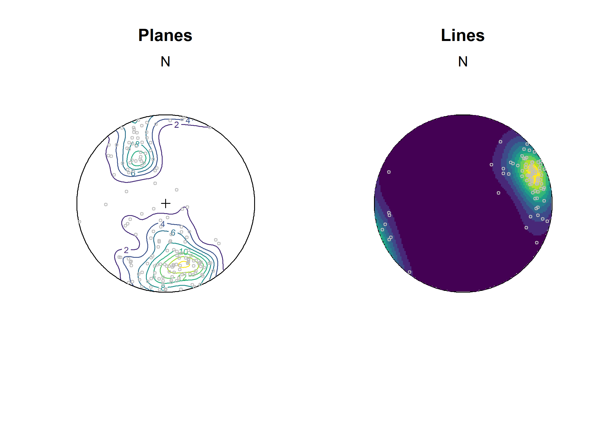

### Spherical statistics

``` r
planes_mean <- sph_mean(example_planes)
planes_geomean <- geodesic_mean(example_planes)
planes_eig <- ot_eigen(example_planes)$vectors

par(mfrow = c(1, 2), xpd = NA)
stereoplot(title = "Planes", guides = FALSE)
points(example_planes, col = "lightgrey", pch = 1, cex = .5)
lines(planes_eig, col = c("#FB8861FF", "#FEC287FF", "#FCFDBFFF"), lty = 1:3)
points(planes_mean, col = "#B63679", pch = 19, cex = 1)
points(planes_geomean, col = "#E65164FF", pch = 19, cex = 1)
points(planes_eig, col = c("#FB8861FF", "#FEC287FF", "#FCFDBFFF"), pch = 19, cex = 1)
legend(
  0, -1.1, xjust = .5,
  legend = c("Arithmetic mean", "Geodesic mean", "Eigen 1", "Eigen 2", "Eigen 3"),
  col = c("#B63679", "#E65164FF", "#FB8861FF", "#FEC287FF", "#FCFDBFFF"),
  pch = 19, lty = c(NA, NA, 1, 2, 3),
  cex = .75
)

lines_mean <- sph_mean(example_lines)
lines_delta <- delta(example_lines)
lines_confangle <- confidence_ellipse(example_lines)

stereoplot(title = "Lines", guides = FALSE)
points(example_lines, col = "lightgrey", pch = 1, cex = .5)
points(lines_mean, col = "#B63679", pch = 19, cex = 1)
stereo_confidence(lines_confangle, col = "#E65164FF")
lines(lines_mean, ang = lines_delta, col = "#FB8861FF")
legend(
  0, -1.1, xjust = .5,
  legend = c("Arithmetic mean", "95% confidence cone", "63% data cone"),
  col = c("#B63679", "#E65164FF", "#FB8861FF"),
  pch = c(19, NA, NA), lty = c(NA, 1, 1), cex = .75
)
```

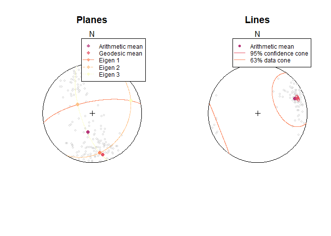

#### Best-fit great and small-circles (geodesic regression)

``` r
set.seed(20250411)
data("gray_example")
cleavage <- gray_example[1:8, ]
bedding <- gray_example[9:16, ]

cleavage_gc <- regression_greatcircle(cleavage)
bedding_gc <- regression_greatcircle(bedding)

cleavage_sc <- regression_smallcircle(cleavage)
bedding_sc <- regression_smallcircle(bedding)

par(mfrow = c(1, 2), xpd = NA)
stereoplot(title = "Best greatcircle", guides = FALSE)
lines(cleavage_gc$vec, col = "#000004FF")
lines(bedding_gc$vec, col = "#B63679")
points(cleavage, col = "#1D1147")
points(bedding, col = "#E65164", pch = 4)

legend(
  0, -1.1,
  xjust = .5,
  col = c("#000004FF", "#B63679"),
  lty = c(1, 1), legend = c("Cleavage greatcircle", "Bedding greatcircle"), bg = "white"
)

stereoplot(title = "Best smallcircle", guides = FALSE)
lines(cleavage_sc$vec, cleavage_sc$cone, col = "#000004FF")
lines(bedding_sc$vec, bedding_sc$cone, col = "#B63679")
points(cleavage, col = "#1D1147")
points(bedding, col = "#E65164", pch = 4)

legend(0, -1.1, xjust = .5,
  col = c("#000004FF", "#B63679"), lty = c(1, 1), legend = c("Cleavage smallcircle", "Bedding smallcircle"), bg = "white"
)
```

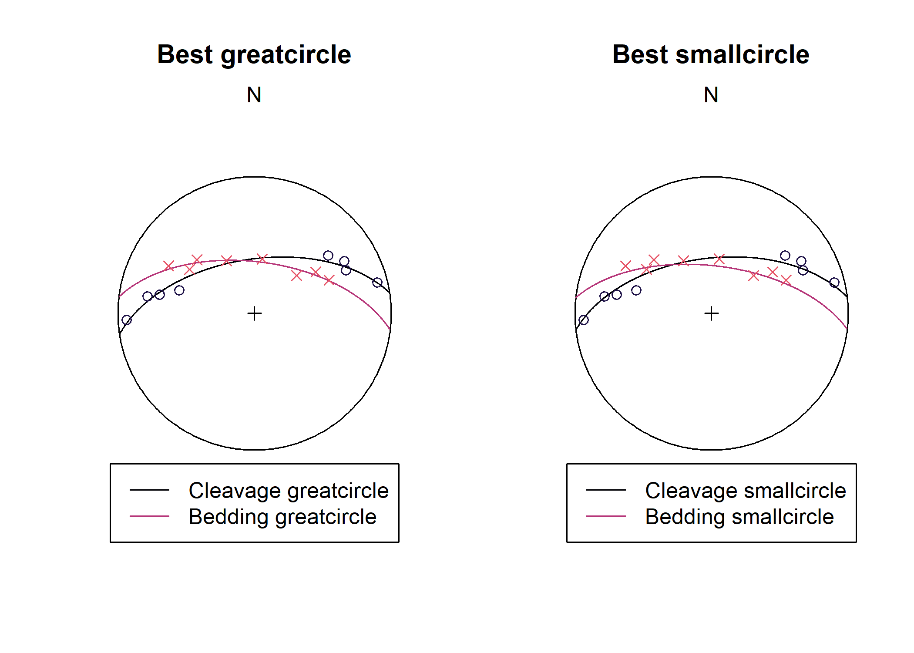

### Orientation tensor and fabric plots

``` r
par(mfrow = c(1, 2), xpd = NA)
vollmer_plot(example_planes, col = "#000004", pch = 16)
vollmer_plot(example_lines, col = "#B63679FF", pch = 16, add = TRUE)
title("Fabric plot of Vollmer (1990)")

hsu_fabric_plot(example_planes, col = "#000004", pch = 16)
hsu_fabric_plot(example_lines, col = "#B63679FF", pch = 16, add = TRUE)

legend(
  2.5, -.25, xjust = .5, horiz = TRUE, xpd = NA,
  legend = c('Planes', 'Lines'), col = c("#000004", "#B63679FF"), pch = 16
)
```

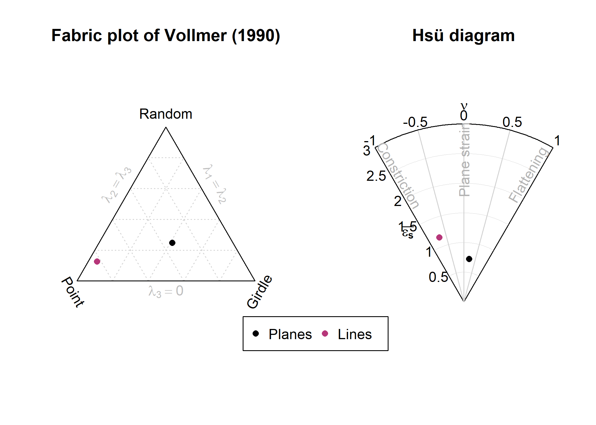

### Fault plots

``` r
data("angelier1990")
faults <- angelier1990$TYM

par(mfrow =c(1, 2))
stereoplot(title = "Angelier plot")
angelier(faults)

stereoplot(title = "Hoeppener plot")
hoeppener(faults, points = FALSE)
```

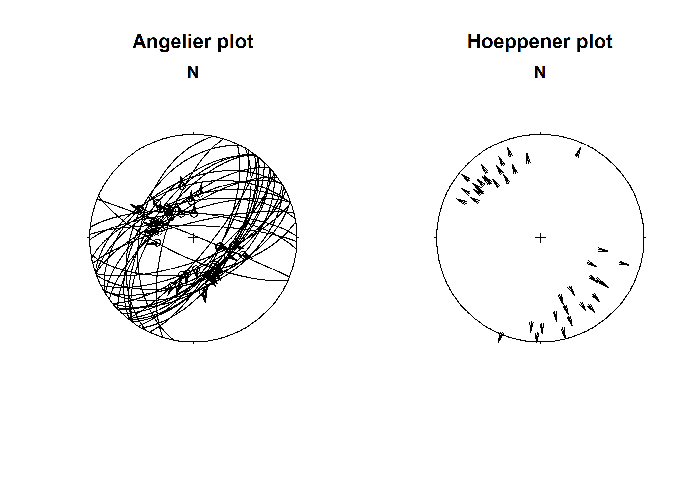

### Fault-slip inversion

Compute deviatoric stress tensor and calculate 95% confidence intervals
using bootstrap samples:

``` r
set.seed(20250411)
faults_stress <- slip_inversion(faults, boot = 10)
```

Visualize the slip inversion results:

``` r
cols <- c("#000004FF", "#B63679FF", "#FEC287FF")
R_val <-  round(faults_stress$R, 2)
R_CI <-  round(faults_stress$R_conf, 2)

stereoplot(
  title = "Principal stress axes",
  sub = paste0("Relative stress magnitudes R = ", R_val, " | ", "95% CI: [", R_CI[1], ", ",R_CI[2], "]"),
  guides = FALSE
)
angelier(faults, col = "grey80")
stereo_confidence(faults_stress$principal_axes_conf$sigma1, col = cols[1])
stereo_confidence(faults_stress$principal_axes_conf$sigma2, col = cols[2])
stereo_confidence(faults_stress$principal_axes_conf$sigma3, col = cols[3])
text(faults_stress$principal_axes,
  label = rownames(faults_stress$principal_axes),
  col = cols, adj = -.25
)
```

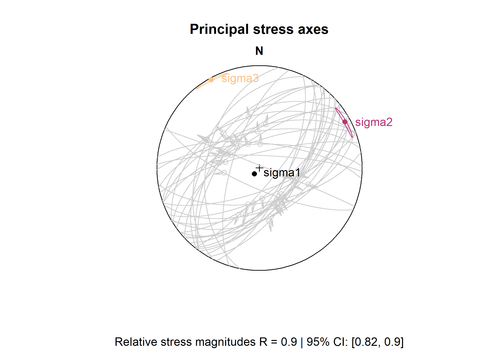

``` r
beta <- faults_stress$fault_data$beta
beta_mean <- round(faults_stress$beta)
beta_CI <- round(faults_stress$beta_CI$conf.angle)

stereoplot(
  title = "Stress inversion accuracy",
  sub = bquote("Average deviation" ~ bar(beta) == .(beta_mean) * degree ~ "\U00B1" ~ .(beta_CI) * degree),
  guides = FALSE
)
angelier(faults, col = assign_col(beta))
legend_c(
  seq(min(beta), max(beta), 10),
  title = bquote("Deviation angle" ~ beta ~ "(" * degree * ")")
)
```

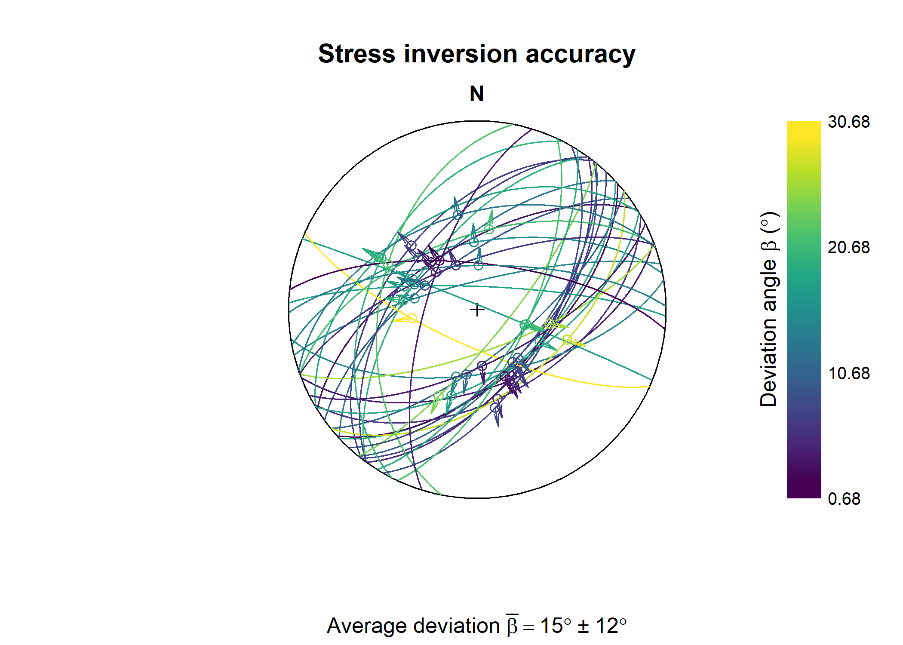

Azimuth of the maximum horizontal stress (in degrees):

``` r
SH(
  S1 = faults_stress$principal_axes[1, ], 
  S2 = faults_stress$principal_axes[2, ], 
  S3 = faults_stress$principal_axes[3, ],
  R = faults_stress$R
)
#> [1] 60.80844
```

### Mohr circles

``` r
Mohr_plot(sigma1 = faults_stress$principal_vals[1], sigma3 = faults_stress$principal_vals[3], unit = NA)
points(faults_stress$fault_data$sigma_n, faults_stress$fault_data$sigma_s)
```

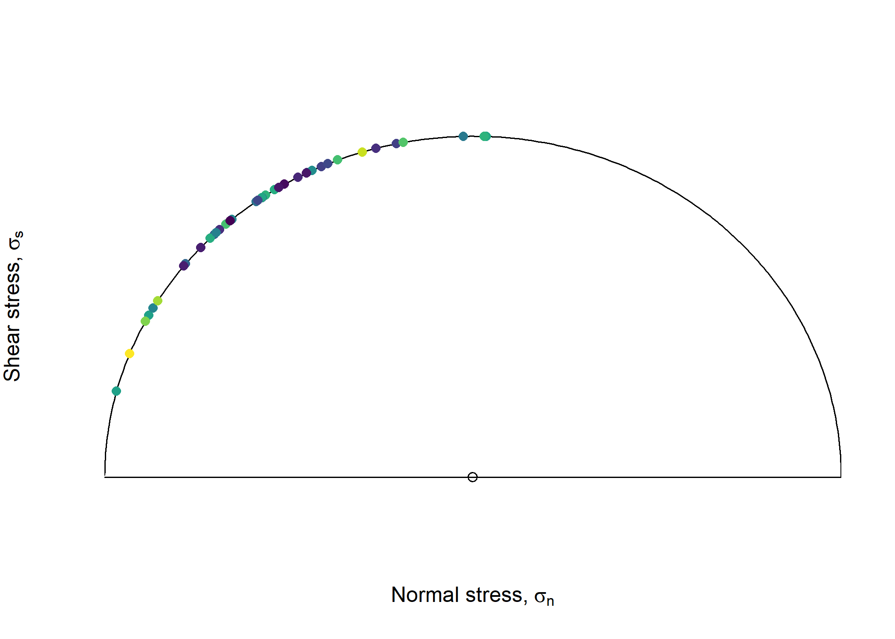

### Strain analysis

#### 2D Strain

``` r
data(ramsay)

par(mfrow = c(1,2))
Rphi_plot(r = ramsay[, 1], phi = ramsay[, 2])
Rphi_polar_plot(ramsay[, 1], ramsay[, 2], proj = "eqd")
```

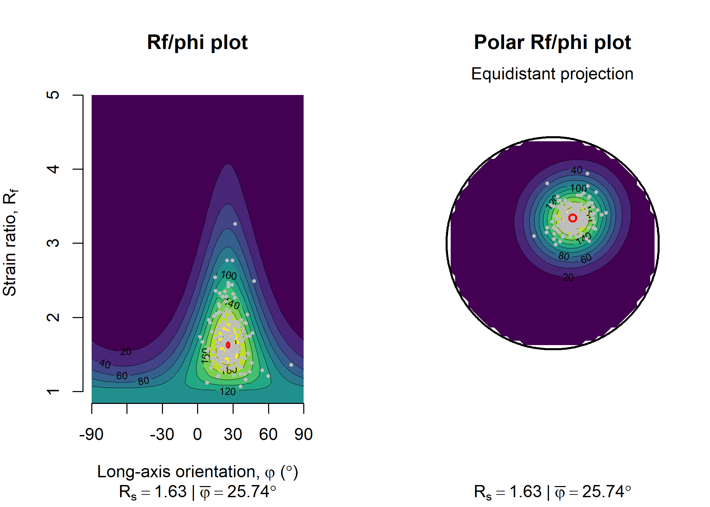

#### 3D Strain

``` r
data("holst")
R_XY <- holst[, "R_XY"]
R_YZ <- holst[, "R_YZ"]

par(mfrow = c(1,2))
flinn_plot(R_XY, R_YZ, log = TRUE, col = "#B63679", pch = 16)
hsu_plot(R_XY, R_YZ, col = "#B63679", pch = 16)
```

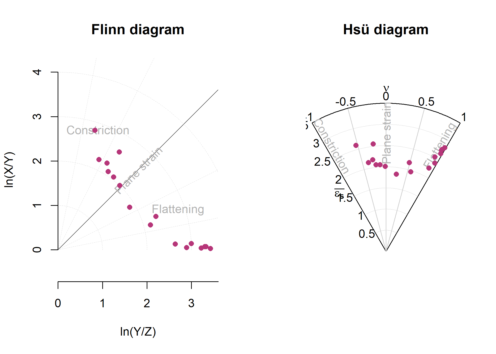

### Vorticity analysis

#### Rigid Grain Net

``` r
# assuming the mean orientation resembles the foliation
theta <- tectonicr::circular_mean(ramsay[, 2]) - ramsay[, 2]

RGN_plot(r = ramsay[, 1], theta = theta, col = "#B63679")
title(main = "Rigid Grain Net")
```

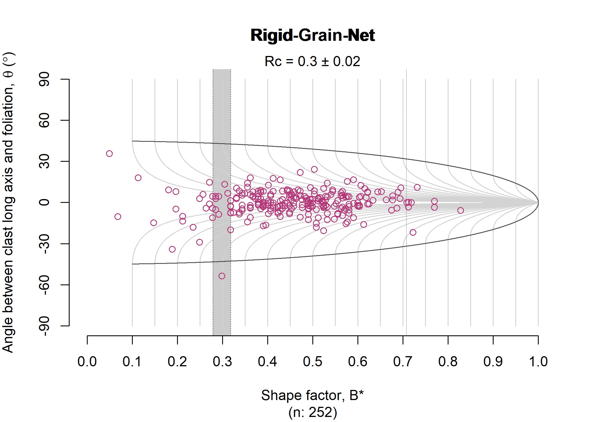

## Author

Tobias Stephan (<tstephan@lakeheadu.ca>)

## Feedback, issues, and contributions

I welcome feedback, suggestions, issues, and contributions! If you have
found a bug, please file it
[here](https://github.com/tobiste/structr/issues) with minimal code to
reproduce the issue.

## License

MIT License
