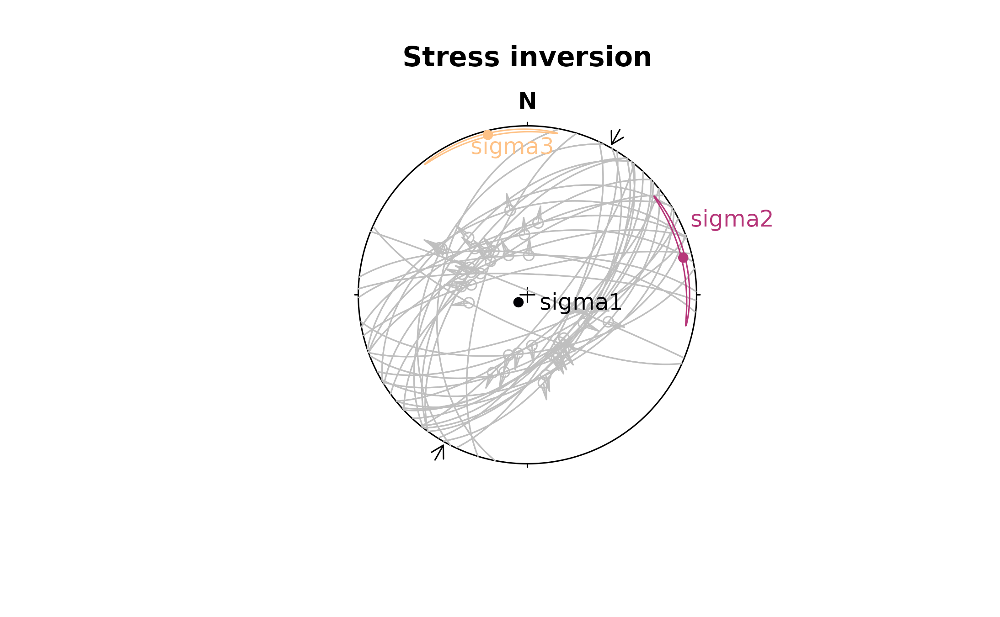

# Faults and Paleostress

This tutorial demonstrates the `"Fault"` object. It also shows how you
can extract paleo-stress directions from fault slip data.

## Fault objects

``` r

# load the structr package
library("structr")

# set up some plotting defaults
options(
  structr.upper.hem = FALSE, structr.earea = TRUE, 
  structr.guides = FALSE
  )
```

A fault is given by the orientation of its plane (dip direction and dip
angle), the orientation of the slip (e.g. measured from striae, given in
azimuth and plunge angles), and the sense of displacement:

``` r

my_fault <- Fault(120, 50, 60, 110, sense = -1)
```

> Sense of fault displacement is 1 or -1 for normal or thrust offset,
> respectively.

Rake of the fault, i.e. the angle between fault slip vector and fault
strike:

``` r

Fault_rake(my_fault)
```

    ## [1] -107.2294

Define a fault by just knowing the orientation of the fault plane, the
sense, and the rake

``` r

# 1. Define a plane through dip direction, dip angle
fault_plane <- Plane(c(120, 120, 100), c(60, 60, 50))

# 2. Define a fault through the plane and rake angle:
Fault_from_rake(fault_plane, rake = c(84.7202, -10, 30))
```

    ## Fault object (n = 3):
    ##      dip_direction dip   azimuth    plunge sense
    ## [1,]           120  60 109.52858 59.581591     1
    ## [2,]           120  60  24.96163 -8.649165    -1
    ## [3,]           100  50  30.36057 22.521012     1

Often, measured orientation angles can be (slightly) imprecise and
subjected to some random noise. Thus the slip vector will not lie
(perfectly) on the fault plane, judging by the measurements. To correct
the measurements so that this will not be the case:

``` r

p <- Pair(120, 60, 110, 58)
```

``` r

misfit_pair(p)
```

    ## $fvec
    ## Vector (Vec3) object (n = 1):
    ##          x          y          z 
    ##  0.4306083 -0.7432653  0.5119893 
    ## 
    ## $lvec
    ## Vector (Vec3) object (n = 1):
    ##          x          y          z 
    ## -0.1752490  0.4876331  0.8552787 
    ## 
    ## $misfit
    ## [1] 0.02793105

``` r

correct_pair(p)
```

    ## Pair object (n = 1):
    ## dip_direction           dip       azimuth        plunge 
    ##     120.08572      59.20357     109.76778      58.79054

> A `"Pair"` object is a container of associated plane and line
> measurements. Basically like a fault without the sense of
> displacement.

## Plotting faults

Fault objects consist of planes (fault plane), lines (e.g. striae), and
the sense of movement. There are two ways how these combined features
can be visualized, namely the Angelier and the Hoeppener plot.

- The **Angelier plot** shows all planes as *great circles* and
  lineations as points (after Angelier, 1984). Fault striae are plotted
  as vectors on top of the lineation pointing in the movement direction
  of the hanging wall. Easy to read in case of homogeneous or small
  datasets.
- The **Hoeppener plot** shows all planes as *poles* while lineations
  are not shown (after Hoeppener, 1955). Instead, fault striae are
  plotted as vectors on top of poles pointing in the movement direction
  of the hanging wall. Useful in case of large or heterogeneous
  datasets.

``` r

# simongomez is a example fault dataset:

# define some colors for each fault in the dataset (here the fault sense)
fault_cols <- assign_col(simongomez[, 5], pal = viridis::magma, begin = .2, end = .8)

par(mfrow = c(1, 2))
stereoplot(title = "Angelier plot")
angelier(simongomez, col = fault_cols)

stereoplot(title = "Hoeppener plot")
hoeppener(simongomez, col = fault_cols, points = FALSE)
```


## Fault stress analysis

The *Wallace-Bott hypothesis* states that fault slip occurs parallel to
the maximum shear stress. This allows to reconstruct stress axes using
fault-slip data. {structr} offers several techniques to calculate the
orientation of principal stress axes, the simple P-T method, and a
fault-slip inversion technique.

### P-T method

This simple technique calculates PT-axes, kinematic plane (M), and
dihedra separation plane (d).

First we load some example data (here the first three faults from the
TYM dataset by from Angelier, 1990)[^1]

``` r

data("angelier1990")
my_fault2 <- angelier1990$TYM[1:3, ]

print(my_fault2)
```

    ## Fault object (n = 3):
    ##      dip_direction dip  azimuth   plunge sense
    ## [1,]           137  61 117.0135 59.46650     1
    ## [2,]           128  59 146.8990 57.58045     1
    ## [3,]             2  80 287.5304 56.63295     1

``` r

my_fault2_PT <- Fault_PT(my_fault2)
print(my_fault2_PT)
```

    ## $p
    ## Line object (n = 3):
    ##       azimuth   plunge
    ## [1,] 340.6153 72.15071
    ## [2,] 281.6092 73.96385
    ## [3,] 214.3217 45.50717
    ## 
    ## $t
    ## Line object (n = 3):
    ##       azimuth   plunge
    ## [1,] 129.6815 15.44075
    ## [2,] 135.2532 13.45689
    ## [3,] 336.9158 27.88916
    ## 
    ## $m
    ## Plane object (n = 3):
    ##      dip_direction       dip
    ## [1,]     222.11395  98.73567
    ## [2,]     223.18909  81.43997
    ## [3,]      85.80721 121.45768
    ## 
    ## $d
    ## Plane object (n = 3):
    ##      dip_direction      dip
    ## [1,]      117.0135 149.4665
    ## [2,]      146.8990 147.5804
    ## [3,]      287.5304 146.6330

Plot the results

``` r

stereoplot(title = "PT results")
fault_plot(my_fault2)
points(my_fault2_PT$p, col = "#B63679FF", pch = 16)
points(my_fault2_PT$t, col = "#FEC287FF", pch = 18)
lines(my_fault2_PT$t, lty = 2, col = "grey40")
lines(my_fault2_PT$d, lty = 3, col = "grey80")

legend("right",
  legend = c("P-axis", "T-axis", "M-plane", "Diheadra"),
  col = c("#B63679FF", "#FEC287FF", "grey40", "grey80"),
  pch = c(16, 18, NA, NA), lty = c(NA, NA, 2, 3)
)
```


### Fault slip inversion

Our goal is to find the single uniform stress tensor that most likely
caused the faulting events. With only slip data to constrain the stress
tensor the isotropic component can not be determined, unless assumptions
about the fracture criterion are made. Hence inversion will be for the
deviatoric stress tensor only. A single fault can not completely
constrain the deviatoric stress tensor a, therefore it is necessary to
simultaneously solve for a number of faults, so that a single a that
best satisfies all of the faults is found.

> This is equivalent to assuming that the stress field is a constant
> tensor within the region being studied for the duration of the
> faulting event.

{structr} provides four numerical solutions to determine the orientation
of the principal stresses from fault slip data.

- *Michael (1984)*: Direct inversion method[^2] which uses bootstrapping
  for confidence intervals of the stress estimates.

- *Angelier (1990)*: Direct inversion method[^3] coupled with the
  iterative optimization after Mostafa (2005)[^4] to find the best fit
  reduced stress tensor.

- *Yamaji & Sato (2006)*: Direct inversion method using the
  5-dimensional parameter space[^5].

- *Hansen (2013)*: Direct inversion using a 9-dimensional parameter
  space, useful when vorticity affects the fault-slip data[^6].

First we load some example data (here the data from Angelier, 1990)[^7]

``` r

fault_data <- angelier1990$TYM

stereoplot(title = "Test data")
fault_plot(fault_data, col = "grey30")
```


The stress inversion using the Michael method with 10 bootstraps:

``` r

inv_res <- slip_inversion(fault_data, method = "michael", n_iter = 10)

# Average alpha angle
inv_res$misfit$alpha
```

    ##  [1] 19.0581833  0.4300616 17.6971171  8.5078919  9.3257870  5.9565593
    ##  [7] 15.0070188  1.1696222 12.2657156  6.2970707 12.1518725  7.3901878
    ## [13]  4.3095800 12.5543133  1.0365795 13.9582802  3.2573252  5.5898020
    ## [19] 28.9782473 29.3190948 12.5920654 16.1272918 37.6709469  4.6992775
    ## [25]  5.0514715 25.5265174 21.6148031 23.1509507  3.9315776 20.8077306
    ## [31] 17.5255311  3.9282757 15.8194428 12.8556026  5.1748022  6.1157113
    ## [37]  7.4467402 11.3905892

``` r

# Average resolved shear stress
inv_res$tau_mean
```

    ## [1] 0.9289024

To check the accuracy of the solution, you can evaluate

- the average angle β between the tangential traction predicted by the
  best stress tensor and the slip vector on each plane (ideally close to
  0), and
- the average resolved shear stress on each plane (should be close to
  1).
- the average “Ratio Upsilon” (RUP) parameter after Angelier (1990),
  ranging from 0 (perfect fit) to 200% (misfit)

To visualizing the orientation of the principal stresses and the
confidence region of the axes, you may use the \[stereoplot()\]
functions from {structr}

``` r

cols <- c("#000004FF", "#B63679FF", "#FEC287FF")

stereoplot(title = "Stress inversion")
fault_plot(fault_data, col = "grey75")
stereo_confidence(inv_res$principal_axes_CI$sigma1, col = cols[1])
stereo_confidence(inv_res$principal_axes_CI$sigma2, col = cols[2])
stereo_confidence(inv_res$principal_axes_CI$sigma3, col = cols[3])
text(inv_res$principal_axes,
  label = rownames(inv_res$principal_axes),
  col = cols, adj = -.25
)
legend("topleft",
  col = cols,
  legend = rownames(inv_res$principal_axes), pch = 16
)
```


The stress shape ratio after Angelier (1979)[^8]:
$`\Phi  = (\sigma_2 - \sigma_3)/(\sigma_1 - \sigma_3)`$

``` r

inv_res$stress_shape$phi
```

    ## [1] 0.101247

``` r

# 95% confidence interval
inv_res$phi_CI
```

    ## [1] 0.08715034 0.15052106

The angle α is the angle between the tangential traction predicted by
the best stress tensor and the slip vector. This deviation can be
visualized in the stereoplot:

``` r

alpha <- inv_res$misfit$alpha

stereoplot(
  title = "Deviation",
  sub = bquote(bar(alpha) == .(round(inv_res$alpha)) * degree)
)

fault_plot(fault_data, col = assign_col(alpha))
legend_col(
  seq(min(alpha), max(alpha), 10),
  title = bquote("Deviation angle" ~ alpha ~ "(" * degree * ")")
)
```


``` r

stress_components <- tau2shearnorm(inv_res$stress_tensor, fault_data, friction = 0.6) 

Mohr_plot(
  sigma1 = inv_res$principal_vals[1],
  sigma2 = inv_res$principal_vals[2],
  sigma3 = inv_res$principal_vals[3],
  unit = NULL, include.zero = FALSE
)
points(stress_components[, 'normal'], abs(stress_components[, 'shear']),
  col = assign_col(alpha), pch = 16
)
```


### Maximum horizontal stress

The orientation of the maximum horizontal stress
($`\sigma_\text{Hmax}`$) can be calculated from the stress tensor the
the orientation of the principal stress ($`\sigma_1`$, $`\sigma_2`$,
$`\sigma_3`$) axes their their relative magnitudes
($`R = (\sigma_1 - \sigma_2)/(\sigma_1 - \sigma_3)`$) [^9].

First, we define the orientation of the principle stress axes:

``` r

S1 <- Line(250.89, 70.07)
S3 <- Line(103.01, 17.07)
```

To get $`\sigma_2`$, which is perpendicular to $`\sigma_1`$ and
$`\sigma_3`$, we calculate the cross-product of the two vectors:

``` r

S2 <- crossprod(S3, S1)
```

The azimuth of $`\sigma_\text{Hmax}`$ for a given stress ratio `R = 1`:

``` r

SH(S1, S2, S3, R = 1) # in degrees
```

    ## [1] 70.89

For a several stress ratios:

``` r

R <- seq(0, 1, .1)
cbind(R, SH = SH(S1, S2, S3, R = R))
```

    ##         R       SH
    ##  [1,] 0.0 13.01021
    ##  [2,] 0.1 13.37695
    ##  [3,] 0.2 13.84162
    ##  [4,] 0.3 14.44908
    ##  [5,] 0.4 15.27621
    ##  [6,] 0.5 16.46586
    ##  [7,] 0.6 18.31445
    ##  [8,] 0.7 21.53704
    ##  [9,] 0.8 28.23884
    ## [10,] 0.9 45.01043
    ## [11,] 1.0 70.89000

The $`\sigma_\text{Hmax}`$ direction for our slip inversion result from
above:

``` r

inv_shmax <- SH(
  S1 = inv_res$principal_axes[1, ],
  S2 = inv_res$principal_axes[2, ],
  S3 = inv_res$principal_axes[3, ],
  R = inv_res$stress_shape$R
)
print(inv_shmax)
```

    ## [1] 60.80844

This (or any) direction can be added as compression arrows to a
stereoplot using \[stereo_shmax()\]:

``` r

stereoplot(title = "Stress inversion")
fault_plot(fault_data, col = "grey75")
stereo_confidence(inv_res$principal_axes_CI$sigma1, col = cols[1])
stereo_confidence(inv_res$principal_axes_CI$sigma2, col = cols[2])
stereo_confidence(inv_res$principal_axes_CI$sigma3, col = cols[3])
text(inv_res$principal_axes,
  label = rownames(inv_res$principal_axes),
  col = cols, adj = -.25
)

stereo_shmax(inv_shmax)
```



## References

Angelier, J. (1979). Determination of the mean principal directions of
stresses for a given fault population. Tectonophysics, 56(3–4), T17–T26.
<https://doi.org/10.1016/0040-1951(79)90081-7>

Angelier, J. (1990). Inversion of field data in fault tectonics to
obtain the regional stress—III. A new rapid direct inversion method by
analytical means. Geophys. J. Int, 103, 363–376.
<https://doi.org/10.1111/j.1365-246X.1990.tb01777.x>

Hansen, J. A. (2013). Direct inversion of stress, strain or strain rate
including vorticity: A linear method of homogenous fault-slip data
inversion independent of adopted hypothesis. Journal of Structural
Geology, 51, 3–13. <https://doi.org/10.1016/j.jsg.2013.03.014>

Lund, B., & Townend, J. (2007). Calculating horizontal stress
orientations with full or partial knowledge of the tectonic stress
tensor. Geophysical Journal International, 170(3), 1328–1335.
<https://doi.org/10.1111/j.1365-246X.2007.03468.x>

Michael, A. J. (1984). Determination of stress from slip data: Faults
and folds. Journal of Geophysical Research: Solid Earth, 89(B13),
11517–11526. <https://doi.org/10.1029/JB089iB13p11517>

Mostafa, M. E. (2005). Iterative direct inversion: An exact
complementary solution for inverting fault-slip data to obtain
palaeostresses. Computers & Geosciences, 31(8), 1059–1070.
<https://doi.org/10.1016/j.cageo.2005.02.012>

Yamaji, A., & Sato, K. (2006). Distances for the solutions of stress
tensor inversion in relation to misfit angles that accompany the
solutions. Geophysical Journal International, 167(2), 933–942.
<https://doi.org/10.1111/j.1365-246X.2006.03188.x>

[^1]: Angelier, J. (1990). Inversion of field data in fault tectonics to
    obtain the regional stress—III. A new rapid direct inversion method
    by analytical means. Geophys. J. Int, 103, 363–376.
    <https://doi.org/10.1111/j.1365-246X.1990.tb01777.x>

[^2]: Michael, A. J. (1984). Determination of stress from slip data:
    Faults and folds. Journal of Geophysical Research: Solid Earth,
    89(B13), 11517–11526. <https://doi.org/10.1029/JB089iB13p11517>

[^3]: Angelier, J. (1990). Inversion of field data in fault tectonics to
    obtain the regional stress—III. A new rapid direct inversion method
    by analytical means. Geophys. J. Int, 103, 363–376.
    <https://doi.org/10.1111/j.1365-246X.1990.tb01777.x>

[^4]: Mostafa, M. E. (2005). Iterative direct inversion: An exact
    complementary solution for inverting fault-slip data to obtain
    palaeostresses. Computers & Geosciences, 31(8), 1059–1070.
    <https://doi.org/10.1016/j.cageo.2005.02.012>

[^5]: Yamaji, A., & Sato, K. (2006). Distances for the solutions of
    stress tensor inversion in relation to misfit angles that accompany
    the solutions. Geophysical Journal International, 167(2), 933–942.
    <https://doi.org/10.1111/j.1365-246X.2006.03188.x>

[^6]: Hansen, J. A. (2013). Direct inversion of stress, strain or strain
    rate including vorticity: A linear method of homogenous fault-slip
    data inversion independent of adopted hypothesis. Journal of
    Structural Geology, 51, 3–13.
    <https://doi.org/10.1016/j.jsg.2013.03.014>

[^7]: Angelier, J. (1990). Inversion of field data in fault tectonics to
    obtain the regional stress—III. A new rapid direct inversion method
    by analytical means. Geophys. J. Int, 103, 363–376.
    <https://doi.org/10.1111/j.1365-246X.1990.tb01777.x>

[^8]: Angelier, J. (1979). Determination of the mean principal
    directions of stresses for a given fault population. Tectonophysics,
    56(3–4), T17–T26. <https://doi.org/10.1016/0040-1951(79)90081-7>

[^9]: Lund & Townend (2007): Calculating horizontal stress orientations
    with full or partial knowledge of the tectonic stress tensor.
    *Geophys. J. Int.*, 170, 1328—1335. doi:
    10.1111/j.1365-246X.2007.03468.x
