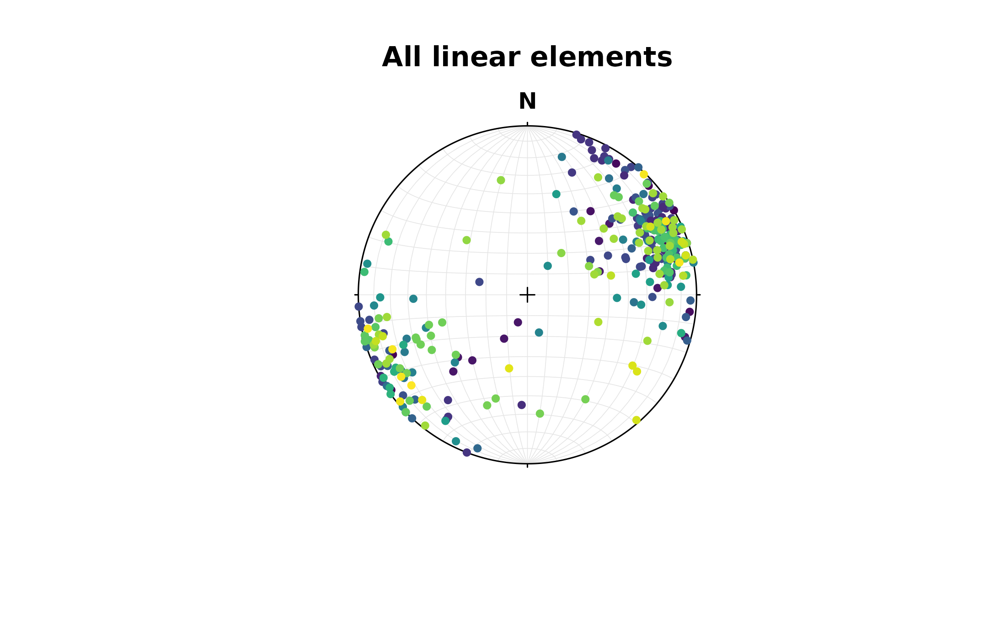
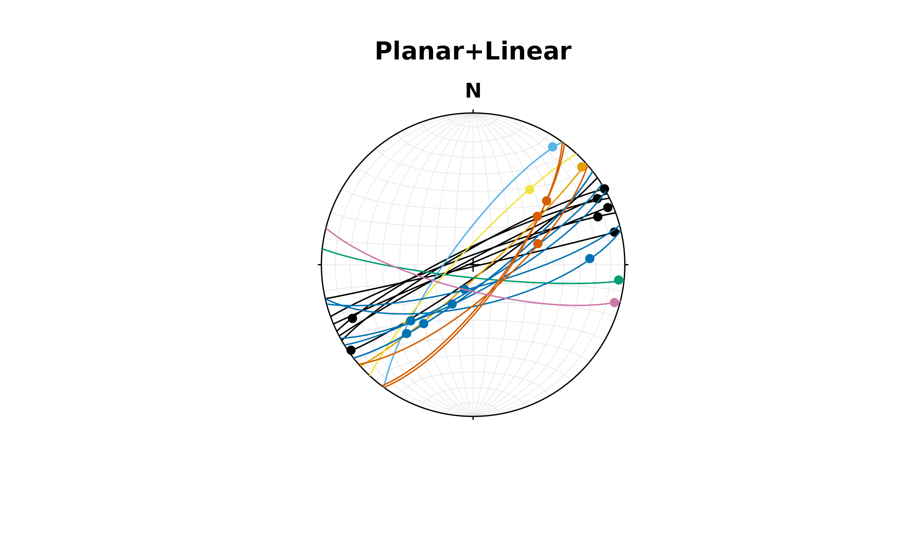
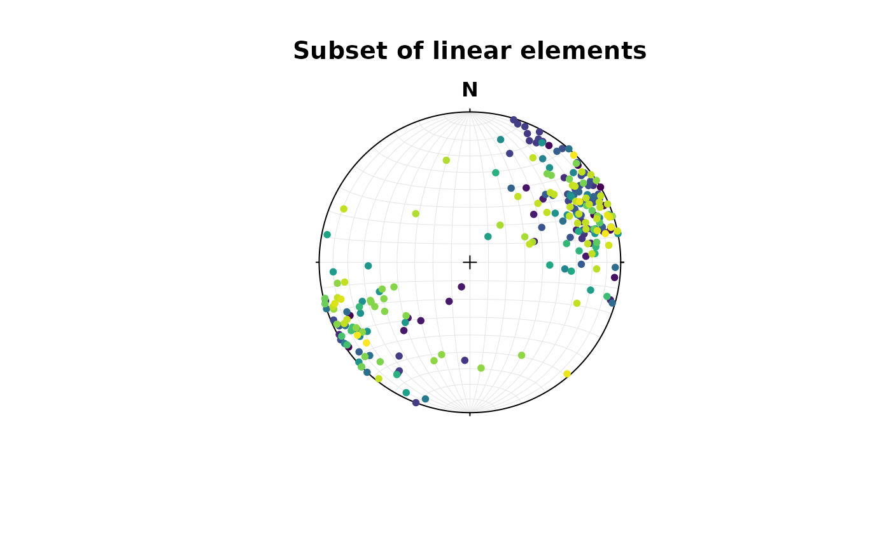

# Import Data

``` r

library(structr)
```

## General

Data can be imported with already in R implemented functions such as
[`read.table()`](https://rdrr.io/r/utils/read.table.html),
[`read.csv()`](https://rdrr.io/r/utils/read.table.html) or from other
packages functions (e.g. [{readr}](https://readr.tidyverse.org/) and
[{data.table}](https://cran.r-project.org/web/packages/data.table/index.html)).
Just make sure that the import produces a matrix or data.frame like
object with each measurement stored in a row, and columns representing
dip directions, dip angles, plunge, etc.

For example your `.txt` file is tab-separated and may look like this:

|     | Dip direction | Dip |
|-----|---------------|-----|
| 1   | 120           | 50  |
| 2   | 60            | 12  |
| 3   | 287           | 82  |

you could import the file like

``` r

imported_data <- read.table(
  "path/to/my/file.xt",
  header = TRUE,
  sep = "",
  row.names = 1
)
```

> You can also use
> [`file.choose()`](https://rdrr.io/r/base/file.choose.html) to open the
> explorer window and navigate to your file.

This imports the tab-separated file as an `"data.frame"` object with the
first column representing the row names, and the two other columns the
headers of the table. Say these measurements represent plane
measurements (e.g. bedding or fault plane orientation), we just need to
coerce that data.frame into a `"Plane"` object:

``` r

my_planes <- as.Plane(imported_data)
```

If you want a `"Line"` object, coerce the data.frame using
[`as.Line()`](https://tobiste.github.io/structr/reference/classes.md).
For `"Pair"` (line-on-plane) and `"Fault"` (line-on-plane with sense of
motion) objects, you’ll need a four and five-column table, respectively,
representing dip directions, dip angle, trend, and plunge and sense
measurements. Then use
[`as.Pair()`](https://tobiste.github.io/structr/reference/classes.md) or
[`as.Fault()`](https://tobiste.github.io/structr/reference/classes.md)
to parse the object into {structr}.

> Note that the **dip direction** is the preferred notation for plane
> measurements in {structr} as it undoubtly indicates the orientation by
> using only 2 parameters.

### Some helpers

There are several other conventions for the notation of plane and line
orientations from compass measurements. Here are some functions for you
to correctly convert your measurements into the notation required for
the use in {structr}.

#### Right-hand rule

To converts strike measurements into dip directions using right-hand
rule:

``` r

strike_measurements <- c(270, 315, 0, 45, 90, 135, 180, 225, 270)
rhr2dd(strike_measurements)
#> [1]   0  45  90 135 180 225 270 315   0

# or from dip direction to strike (using right-hand rule):
dip_directions <- c(0, 45, 90, 135, 180, 225, 270, 315, 360)
dd2rhr(dip_directions)
#> [1] 270 315   0  45  90 135 180 225 270
```

#### Quadrant notation

Sometimes, strike notation doesn’t follow the right hand rule. Instead
the quadrant of the dip direction is indicated by a Cardinal letter,
i.e. “N”, “E”, “S”, and “W”. In that case you can use the function
[`quadrant2dd()`](https://tobiste.github.io/structr/reference/quadrant2dd.md)

``` r

strike_direction <- c(270, 315, 0, 45, 90, 135, 180, 225, 270) # strike in left-hand-rule
dip_quadrtant <- c("N", "E", "E", "S", "S", "W", "W", "N", "N") # dip quadrant
quadrant2dd(strike_direction, dip_quadrtant)
#> [1]   0  45  90 135 180 225 270 315   0
```

If your table contains the strike and dip-quadrant measurement in a
single column, e.g. “270N”, you can conveniently split the column into
two by using
[`split_strike()`](https://tobiste.github.io/structr/reference/split.md)

``` r

split_strike("270N")
#> $measurement
#> 270N 
#>  270 
#> 
#> $direction
#> 270N 
#>  "N"
```

#### Fault notation

Fault (and Pair) measurements are usually a combination of Plane and Ray
or Line measurements. Then they can be defined using the
[`Fault()`](https://tobiste.github.io/structr/reference/classes.md) and
[`Pair()`](https://tobiste.github.io/structr/reference/classes.md)
functions. However, sometimes the Line or Ray component is given by the
rake angle, which is the angle between the fault strike and the
lineation. Unfortunately, there are several different ways how to
indicate the proper orientation of the lineation.

##### Fault plane and rake (or pitch)

This is the standard notation. Here, the rake is the angle between
lineation and the right-handrule strike of the fault plane. The angle is
measured on the fault plane, clockwise from the strike, where
down-plunging is positive. Rake values range between 0 and 360° (or
−180° and 180°).

If your datra follows this convention, use the function
[`Fault_from_rake()`](https://tobiste.github.io/structr/reference/fault-rake.md)

``` r

fault_plane <- Plane(c(120, 120, 100, 0), c(60, 60, 50, 40))
fault_pitch <- c(84.7202, -10, 30, 180)
Fault_from_rake(fault_plane, rake = fault_pitch)
#> Fault object (n = 4):
#>      dip_direction dip   azimuth       plunge sense
#> [1,]           120  60 109.52858 5.958159e+01     1
#> [2,]           120  60 204.96163 8.649165e+00    -1
#> [3,]           100  50  30.36057 2.252101e+01     1
#> [4,]             0  40  90.00000 1.487542e-14     1
```

##### Fault plane, rake angle and plunge quadrant

Here, the rake angle is measured in the fault plane between the strike
given by either right or left-hand rule and the lineation. The angle is
recorded in a clockwise sense (looking down upon the fault plane) and
has a range from 0 to 180%deg;. The quadrant of plunge indicates the
direction of the strike from which the rake angle is measured.

If this is the notation used, call the function
[`Fault_from_rake_quadrant()`](https://tobiste.github.io/structr/reference/Fault_from_rake_quadrant.md)
and set `type="plunge"`

``` r

dip <- c(5, 10, 15, 30, 40, 55, 65, 75, 90)
dip_dir <- c(180, 225, 270, 315, 360, 0, 45, 90, 135)
rake1 <- c(0, 45, 90, 135, 180, 45, 90, 135, 180)
plunge_quadrant <- c("E", "S", "W", "N", "E", "W", "E", "S", "W")
Fault_from_rake_quadrant(Plane(dip_dir, dip), rake1, plunge_quadrant, type = "plunge")
#> Fault object (n = 9):
#>       dip_direction dip    azimuth       plunge sense
#>  [1,]           180   5  90.000000 0.000000e+00     1
#>  [2,]           225  10 179.561451 7.053022e+00     1
#>  [3,]           270  15 270.000000 1.500000e+01     1
#>  [4,]           315  30   4.106605 2.070481e+01     1
#>  [5,]             0  40  90.000000 1.487542e-14     1
#>  [6,]             0  55 299.837566 3.539626e+01     1
#>  [7,]            45  65  45.000000 6.500000e+01     1
#>  [8,]            90  75 165.489181 4.307952e+01     1
#>  [9,]           135  90 225.000000 7.016709e-15     1
```

##### Fault plane, rake angle and rake quadrant

Here, the rake is the **acute** angle measured in the fault plane
between the strike of the fault and the lineation. Starting from the
strike line, the angle is measured in a sense which is down the dip of
the plane. Quadrant of rake indicate the direction of the strike from
which the rake angle is measured, i.e. whether right-hand or left-hand
rule is followed. Angle ranges from 0 to 90 °. Use `sense` argument to
specify the sense of motion.

If this is the notation used, call the function
[`Fault_from_rake_quadrant()`](https://tobiste.github.io/structr/reference/Fault_from_rake_quadrant.md)
and set `type="rake"`

``` r

rake2 <- c(0, 45, 90, 45, 0, 45, 90, 45, 0)
rake_quadrant <- c("E", "S", "S", "E", "E", "W", "N", "S", "W")
Fault_from_rake_quadrant(Plane(dip_dir, dip), rake2, rake_quadrant, type = "rake")
#> Fault object (n = 9):
#>       dip_direction dip    azimuth    plunge sense
#>  [1,]           180   5  90.000000  0.000000     1
#>  [2,]           225  10 179.561451  7.053022     1
#>  [3,]           270  15 270.000000 15.000000     1
#>  [4,]           315  30   4.106605 20.704811     1
#>  [5,]             0  40 270.000000  0.000000     1
#>  [6,]             0  55 299.837566 35.396260     1
#>  [7,]            45  65  45.000000 65.000000     1
#>  [8,]            90  75 165.489181 43.079517     1
#>  [9,]           135  90  45.000000  0.000000     1
```

## StraboSpot

The package {structr} can import all the collected field data from your
[Strabospot](https://strabospot.org) project.

The best way is to import the .json file database of the StraboSpot
project. Go to your field data **My StraboField Data** \> scroll down to
your project \> click on **Options…** \> **Download Project in Strabo
JSON Format**

Now you can import the downloaded file via
[`read_strabo_JSON()`](https://tobiste.github.io/structr/reference/strabo.md):

``` r

strabo_data <- read_strabo_JSON("path/to/my/file.json")
```

The import function produces a `list` object with all the meta data
(`data`), the geographic locations (`spots`), the used tags (`tags`),
and all the plane (`planes`) and line measurements (`lines`) already
converted into {structr} data objects.

``` r

names(strabo_data)
#> [1] "data"   "spots"  "tags"   "planar" "linear"
```

``` r

plot(strabo_data$linear, col = assign_col_d(strabo_data$data$spot_id)) 
title(main = 'All linear elements')
```



The `"strabo"` objects are list objects containing orientation data as
planar and linear objects as well as several slots containing your
metadata (`data`) and geospatial information (`spots`).

**IMPORTANT**: The meta data and the plane and line measurements all
share the same row indices. Thus, planes and lines with identical row
indices have been measured simultaneously (e.g. as a fault).

``` r

Pair(strabo_data$planar, strabo_data$linear) |> 
  plot(col = assign_col_d(strabo_data$data$spot_id))
title(main = 'Planar+Linear')
```



> This import allows that the connection of simultaneously measured
> plane and lines (such as faults and their striae) will be preserved.
> Unfortunately, if you **export** your StraboSpot field data into a
> `.csv` or `.xls` file, this connection is lost…

Alternatively, the function
[`read_strabo_xls()`](https://tobiste.github.io/structr/reference/strabo.md)
and
[`read_strabo_mobile()`](https://tobiste.github.io/structr/reference/strabo.md)
provide import of `.xls` and any character-separated table files
(e.g. `.csv` or `.txt`).

> Keep in mind that these import options do not properly identify
> whether your lineation measurements are ray-like or line-like vectors,
> nor does it combine simultaneously lineation-plane measurements to
> either pairs or faults. Thus, you’ll need to carefully convert these
> data dataypes after the import to move forward.

### Subsetting Strabo objects

One advantage of `"strabo"` objects is that the orientation data is
accompanied with metadata such as GPS coordinates, descriptions etc.
This makes it a data base which can be filtered, arranged and
manipulated using queries the way you want it.

You can subset (or filter) the objects based on columns in any of these
list elements, and it returns only the selected rows in all elements of
the list, including the orientation data:

``` r

strabo_prj_subset <- subset(strabo_prj, strabo_prj$data$quality > 3)
plot(strabo_prj_subset$linear, col = assign_col_d(strabo_prj_subset$data$spot_id))
title(main = 'Subset of linear elements')
```



### Sort Strabo objects

The function [`sort_by()`](https://rdrr.io/r/base/sort_by.html) can sort
your strabo objects based on one or more columns in the `data` and will
automatically sort all planar and linear elements.

    #> $data
    #>                                        id dip_direction   dip strike plunge
    #>                                    <char>         <num> <num>  <num>  <num>
    #>   1: bd459927-9a46-429e-969f-18c5c8d34df9           158    88     68     38
    #>   2: 4944454c-dcb7-4732-9ad7-43df22c3b202           159    87     69     22
    #>   3: 482be319-1a85-485c-a304-b290b7df5cce           337    89    247     16
    #>   4: ae51a581-9c2c-4137-82e9-391865e743c8           349    86    259      0
    #>   5: cf641d6a-3d06-4fc0-9856-592949d051ac           350    84    260     31
    #>  ---                                                                       
    #> 343: 515437db-b8c6-42fb-ac75-40ecbb04d06b           162    85     72     48
    #> 344: 990aba11-c589-42fe-9371-6dd0bb2f0b9b           210    77    120     22
    #> 345: fdcccf01-e55f-49fe-b13f-99e52691d530           142    65     52     53
    #> 346: f9be6859-0837-4225-9fdd-e3bc6d79329a           332    88    242      8
    #> 347: 1d777418-201b-4e19-8579-f1ba6044ba64           140    83     50      2
    #>      trend associated planar_type quality unix_timestamp  notes
    #>      <num>     <lgcl>      <char>  <char>          <num> <char>
    #>   1:    69       TRUE        <NA>       1   1.687792e+12   <NA>
    #>   2:    70       TRUE        <NA>       1   1.687792e+12   <NA>
    #>   3:    67       TRUE        <NA>       1   1.687792e+12   <NA>
    #>   4:   259       TRUE        <NA>       1   1.687792e+12   <NA>
    #>   5:    76       TRUE        <NA>       1   1.687792e+12   <NA>
    #>  ---                                                           
    #> 343:    77       TRUE        <NA>    <NA>   1.693159e+12   <NA>
    #> 344:   125       TRUE        <NA>    <NA>   1.721842e+12   <NA>
    #> 345:   194       TRUE        <NA>    <NA>   1.721844e+12   <NA>
    #> 346:    62       TRUE        <NA>    <NA>   1.721916e+12   <NA>
    #> 347:   230       TRUE        <NA>    <NA>   1.721916e+12   <NA>
    #>      modified_timestamp           spot        spot_id feature_type
    #>                   <num>         <char>         <char>       <char>
    #>   1:                 NA  23-TS-Moss-40 16877910624414    foliation
    #>   2:                 NA  23-TS-Moss-40 16877910624414    foliation
    #>   3:                 NA  23-TS-Moss-40 16877910624414    foliation
    #>   4:                 NA  23-TS-Moss-40 16877910624414    foliation
    #>   5:                 NA  23-TS-Moss-40 16877910624414    foliation
    #>  ---                                                              
    #> 343:                 NA 23-TS-Moss-182 16931591128778    foliation
    #> 344:                 NA         24TS-5 17218408233859    foliation
    #> 345:                 NA         24TS-6 17218433797553    foliation
    #> 346:                 NA        24TS-15 17219160056874    foliation
    #> 347:                 NA        24TS-15 17219160056874    foliation
    #>       foliation_type  label contact_type fault_or_sz_type bedding_type
    #>               <char> <char>       <char>           <char>       <char>
    #>   1:     schistosity   <NA>         <NA>             <NA>         <NA>
    #>   2:     schistosity   <NA>         <NA>             <NA>         <NA>
    #>   3:     schistosity   <NA>         <NA>             <NA>         <NA>
    #>   4:     schistosity   <NA>         <NA>             <NA>         <NA>
    #>   5:     schistosity   <NA>         <NA>             <NA>         <NA>
    #>  ---                                                                  
    #> 343: slatey_cleavage   <NA>         <NA>             <NA>         <NA>
    #> 344:            <NA>   <NA>         <NA>             <NA>         <NA>
    #> 345:            <NA>   <NA>         <NA>             <NA>         <NA>
    #> 346:            <NA>   <NA>         <NA>             <NA>         <NA>
    #> 347:            <NA>   <NA>         <NA>             <NA>         <NA>
    #>      vein_fill directional_indicators vein_type other_vein_fill
    #>         <char>                 <char>    <char>          <char>
    #>   1:      <NA>                   <NA>      <NA>            <NA>
    #>   2:      <NA>                   <NA>      <NA>            <NA>
    #>   3:      <NA>                   <NA>      <NA>            <NA>
    #>   4:      <NA>                   <NA>      <NA>            <NA>
    #>   5:      <NA>                   <NA>      <NA>            <NA>
    #>  ---                                                           
    #> 343:      <NA>                   <NA>      <NA>            <NA>
    #> 344:      <NA>                   <NA>      <NA>            <NA>
    #> 345:      <NA>                   <NA>      <NA>            <NA>
    #> 346:      <NA>                   <NA>      <NA>            <NA>
    #> 347:      <NA>                   <NA>      <NA>            <NA>
    #>      foliation_defined_by movement other_feature fracture_type
    #>                    <char>   <char>        <char>        <char>
    #>   1:                 <NA>     <NA>          <NA>          <NA>
    #>   2:                 <NA>     <NA>          <NA>          <NA>
    #>   3:                 <NA>     <NA>          <NA>          <NA>
    #>   4:                 <NA>     <NA>          <NA>          <NA>
    #>   5:                 <NA>     <NA>          <NA>          <NA>
    #>  ---                                                          
    #> 343:                   Bt     <NA>          <NA>          <NA>
    #> 344:                 <NA>     <NA>          <NA>          <NA>
    #> 345:                 <NA>     <NA>          <NA>          <NA>
    #> 346:                 <NA>     <NA>          <NA>          <NA>
    #> 347:                 <NA>     <NA>          <NA>          <NA>
    #>      movement_justification        linear_type linear_quality linear_notes
    #>                      <char>             <char>         <char>       <char>
    #>   1:                   <NA> linear_orientation              1         <NA>
    #>   2:                   <NA> linear_orientation              1         <NA>
    #>   3:                   <NA> linear_orientation              1         <NA>
    #>   4:                   <NA> linear_orientation              1         <NA>
    #>   5:                   <NA> linear_orientation              1         <NA>
    #>  ---                                                                      
    #> 343:                   <NA> linear_orientation           <NA>         <NA>
    #> 344:                   <NA> linear_orientation           <NA>         <NA>
    #> 345:                   <NA> linear_orientation           <NA>         <NA>
    #> 346:                   <NA> linear_orientation           <NA>         <NA>
    #> 347:                   <NA> linear_orientation           <NA>         <NA>
    #>      linear_feature_type linear_defined_by linear_label               type
    #>                   <char>            <char>       <char>             <char>
    #>   1:          stretching               Hbl         <NA> planar_orientation
    #>   2:          stretching               Hbl         <NA> planar_orientation
    #>   3:          stretching               Hbl         <NA> planar_orientation
    #>   4:          stretching               Hbl         <NA> planar_orientation
    #>   5:          stretching               Hbl         <NA> planar_orientation
    #>  ---                                                                      
    #> 343:       mineral_align               Sta         <NA> planar_orientation
    #> 344:       mineral_align              <NA>         <NA> planar_orientation
    #> 345:       mineral_align              <NA>         <NA> planar_orientation
    #> 346:       mineral_align              <NA>         <NA> planar_orientation
    #> 347:       mineral_align              <NA>         <NA> planar_orientation
    #>      linear_unix_timestamp                            linear_id defined_by
    #>                      <num>                               <char>     <char>
    #>   1:          1.687792e+12 ac9e945e-9176-4071-a5a3-a65061bd9fa1       <NA>
    #>   2:          1.687792e+12 219e3793-497e-46be-bdd6-31b970b9186a       <NA>
    #>   3:          1.687792e+12 e799be63-352b-42fb-a48e-9e8b27d2552b       <NA>
    #>   4:          1.687792e+12 606bdc8a-f66c-48f9-be60-5a189fedbe45       <NA>
    #>   5:          1.687792e+12 669c2a86-4e85-44f3-b29a-d31e61c5a19f       <NA>
    #>  ---                                                                      
    #> 343:          1.693159e+12 c0fff5d1-967d-4b33-a7c4-bb5f92ee7863       <NA>
    #> 344:          1.721842e+12 b759ecf6-e65a-424e-a075-cd986e4d7e49       <NA>
    #> 345:          1.721844e+12 2f3cf8f1-9d0d-46b3-9118-3f56ee44304b       <NA>
    #> 346:          1.721916e+12 7204ea74-45c9-43d8-9034-c0079ceab24c       <NA>
    #> 347:          1.721916e+12 aae17048-ee82-4fcd-849f-8f9b1aff002e       <NA>
    #>      linear_other_feature
    #>                    <char>
    #>   1:                 <NA>
    #>   2:                 <NA>
    #>   3:                 <NA>
    #>   4:                 <NA>
    #>   5:                 <NA>
    #>  ---                     
    #> 343:                 <NA>
    #> 344:                 <NA>
    #> 345:                 <NA>
    #> 346:                 <NA>
    #> 347:                 <NA>
    #> 
    #> $planar
    #> Plane object (n = 347):
    #>        dip_direction dip
    #>   [1,]           158  88
    #>   [2,]           159  87
    #>   [3,]           337  89
    #>   [4,]           349  86
    #>   [5,]           350  84
    #>   [6,]           342  89
    #>   [7,]           132  74
    #>   [8,]           171  88
    #>   [9,]           351  88
    #>  [10,]           186  78
    #>  [11,]           141  68
    #>  [12,]           168  68
    #>  [13,]           197  59
    #>  [14,]           158  90
    #>  [15,]           347  88
    #>  [16,]           161  84
    #>  [17,]           341  87
    #>  [18,]           154  70
    #>  [19,]           353  89
    #>  [20,]           329  83
    #>  [21,]           330  84
    #>  [22,]           325  66
    #>  [23,]           329  80
    #>  [24,]           166  89
    #>  [25,]           150  48
    #>  [26,]           145  49
    #>  [27,]           146  63
    #>  [28,]           345  74
    #>  [29,]           316  85
    #>  [30,]           145  86
    #>  [31,]           327  82
    #>  [32,]           190  33
    #>  [33,]           167  30
    #>  [34,]           187  35
    #>  [35,]           161  88
    #>  [36,]            50  60
    #>  [37,]           348  88
    #>  [38,]           325  82
    #>  [39,]           332  87
    #>  [40,]           337  89
    #>  [41,]           145  84
    #>  [42,]           330  82
    #>  [43,]           334  81
    #>  [44,]           340  85
    #>  [45,]           167  89
    #>  [46,]           138  84
    #>  [47,]           306  77
    #>  [48,]           306  77
    #>  [49,]           186  83
    #>  [50,]           313  82
    #>  [51,]           148  79
    #>  [52,]           142  79
    #>  [53,]           142  79
    #>  [54,]           151  76
    #>  [55,]           165  78
    #>  [56,]           167  68
    #>  [57,]           126  73
    #>  [58,]           127  74
    #>  [59,]           139  73
    #>  [60,]           194  76
    #>  [61,]           160  85
    #>  [62,]           166  81
    #>  [63,]           165  75
    #>  [64,]           162  84
    #>  [65,]           165  81
    #>  [66,]           166  85
    #>  [67,]           152  47
    #>  [68,]           323  75
    #>  [69,]           337  72
    #>  [70,]           163  79
    #>  [71,]           343  84
    #>  [72,]           156  88
    #>  [73,]           161  80
    #>  [74,]           348  86
    #>  [75,]           328  89
    #>  [76,]           337  77
    #>  [77,]           109  67
    #>  [78,]           113  83
    #>  [79,]           113  83
    #>  [80,]           113  75
    #>  [81,]           113  75
    #>  [82,]           115  68
    #>  [83,]           115  68
    #>  [84,]           117  63
    #>  [85,]           117  63
    #>  [86,]           106  73
    #>  [87,]           111  70
    #>  [88,]           117  69
    #>  [89,]           129  66
    #>  [90,]           129  66
    #>  [91,]           129  69
    #>  [92,]           129  69
    #>  [93,]           134  73
    #>  [94,]           134  73
    #>  [95,]           111  74
    #>  [96,]           111  74
    #>  [97,]           108  65
    #>  [98,]           108  65
    #>  [99,]           118  80
    #> [100,]           297  74
    #> [101,]           143  79
    #> [102,]           140  77
    #> [103,]           153  88
    #> [104,]           153  88
    #> [105,]           158  77
    #> [106,]           158  77
    #> [107,]           137  78
    #> [108,]           137  78
    #> [109,]           128  80
    #> [110,]           128  80
    #> [111,]           327  89
    #> [112,]           327  89
    #> [113,]           329  83
    #> [114,]           329  83
    #> [115,]           334  87
    #> [116,]           334  87
    #> [117,]           144  87
    #> [118,]           144  87
    #> [119,]           146  84
    #> [120,]           146  84
    #> [121,]           334  87
    #> [122,]           334  87
    #> [123,]           142  80
    #> [124,]           142  80
    #> [125,]           151  78
    #> [126,]           151  78
    #> [127,]           137  56
    #> [128,]           137  56
    #> [129,]           141  75
    #> [130,]           141  75
    #> [131,]           155  84
    #> [132,]           348  82
    #> [133,]           340  84
    #> [134,]           338  84
    #> [135,]           349  85
    #> [136,]           154  89
    #> [137,]           336  84
    #> [138,]           352  89
    #> [139,]           344  88
    #> [140,]           180  87
    #> [141,]           346  82
    #> [142,]           320  74
    #> [143,]           135  85
    #> [144,]           309  85
    #> [145,]           326  80
    #> [146,]           330  78
    #> [147,]           311  78
    #> [148,]           146  88
    #> [149,]           332  87
    #> [150,]           338  87
    #> [151,]             3  81
    #> [152,]           195  82
    #> [153,]           150  81
    #> [154,]           311  72
    #> [155,]           315  79
    #> [156,]           333  85
    #> [157,]           313  81
    #> [158,]           162  76
    #> [159,]           286  68
    #> [160,]           161  87
    #> [161,]           335  81
    #> [162,]           327  83
    #> [163,]           313  68
    #> [164,]           316  71
    #> [165,]           333  75
    #> [166,]           319  89
    #> [167,]           332  74
    #> [168,]           149  89
    #> [169,]            86  38
    #> [170,]           320  68
    #> [171,]           285  86
    #> [172,]           330  76
    #> [173,]           337  83
    #> [174,]           130  89
    #> [175,]           304  71
    #> [176,]           148  86
    #> [177,]           346  85
    #> [178,]           347  89
    #> [179,]           339  83
    #> [180,]           151  84
    #> [181,]           318  87
    #> [182,]           146  89
    #> [183,]           169  89
    #> [184,]           328  88
    #> [185,]           321  47
    #> [186,]           191  47
    #> [187,]           299  48
    #> [188,]           178  78
    #> [189,]           191  84
    #> [190,]           295  77
    #> [191,]           305  89
    #> [192,]           192  76
    #> [193,]           164  73
    #> [194,]           160  55
    #> [195,]           322  54
    #> [196,]           299  70
    #> [197,]           169  67
    #> [198,]           166  75
    #> [199,]           336  85
    #> [200,]           193  79
    #> [201,]           352  53
    #> [202,]           152  43
    #> [203,]           344  76
    #> [204,]           311  46
    #> [205,]           297  40
    #> [206,]           323  77
    #> [207,]           318  73
    #> [208,]           314  88
    #> [209,]           319  71
    #> [210,]           159  86
    #> [211,]           335  84
    #> [212,]           339  86
    #> [213,]           330  89
    #> [214,]           326  88
    #> [215,]           334  81
    #> [216,]           330  89
    #> [217,]           333  81
    #> [218,]           336  88
    #> [219,]           332  84
    #> [220,]           334  78
    #> [221,]           141  88
    #> [222,]           341  81
    #> [223,]           195  36
    #> [224,]           194  32
    #> [225,]           342  86
    #> [226,]           334  78
    #> [227,]           353  82
    #> [228,]             4  72
    #> [229,]             5  32
    #> [230,]             0  61
    #> [231,]             9  73
    #> [232,]            10  36
    #> [233,]            23  35
    #> [234,]           326  26
    #> [235,]           328  37
    #> [236,]           339  60
    #> [237,]           338  58
    #> [238,]             8  59
    #> [239,]             5  58
    #> [240,]           353  35
    #> [241,]           329  66
    #> [242,]           331  70
    #> [243,]           337  74
    #> [244,]           333  81
    #> [245,]           157  82
    #> [246,]            12  22
    #> [247,]            89  57
    #> [248,]            62  40
    #> [249,]            34  64
    #> [250,]           350  59
    #> [251,]            14  51
    #> [252,]           353  60
    #> [253,]           119  56
    #> [254,]           323  73
    #> [255,]           341  89
    #> [256,]           350  29
    #> [257,]           348  50
    #> [258,]           334  55
    #> [259,]           342  86
    #> [260,]           350  74
    #> [261,]           345  71
    #> [262,]           329  73
    #> [263,]           336  72
    #> [264,]           341  73
    #> [265,]           306  59
    #> [266,]           331  66
    #> [267,]           161  72
    #> [268,]           348  86
    #> [269,]           173  89
    #> [270,]           342  78
    #> [271,]           164  87
    #> [272,]           343  74
    #> [273,]           342  57
    #> [274,]           347  82
    #> [275,]           314  73
    #> [276,]           320  82
    #> [277,]           163  85
    #> [278,]           336  74
    #> [279,]           345  81
    #> [280,]           159  87
    #> [281,]           165  89
    #> [282,]           170  81
    #> [283,]           346  82
    #> [284,]           338  85
    #> [285,]           356  88
    #> [286,]           161  77
    #> [287,]           331  70
    #> [288,]           329  66
    #> [289,]           322  74
    #> [290,]           358  83
    #> [291,]           358  87
    #> [292,]           336  85
    #> [293,]           332  78
    #> [294,]           164  85
    #> [295,]           162  88
    #> [296,]           331  87
    #> [297,]           169  77
    #> [298,]           156  85
    #> [299,]           146  79
    #> [300,]           163  64
    #> [301,]           128  85
    #> [302,]           339  78
    #> [303,]           338  77
    #> [304,]           331  82
    #> [305,]           332  84
    #> [306,]           150  74
    #> [307,]           337  81
    #> [308,]           330  87
    #> [309,]           324  81
    #> [310,]           344  64
    #> [311,]           339  85
    #> [312,]           341  62
    #> [313,]           338  58
    #> [314,]           159  79
    #> [315,]           341  80
    #> [316,]           335  79
    #> [317,]           345  50
    #> [318,]           344  52
    #> [319,]           346  60
    #> [320,]             6  42
    #> [321,]             6  48
    #> [322,]             4  38
    #> [323,]             0  42
    #> [324,]             2  41
    #> [325,]           349  41
    #> [326,]           352  36
    #> [327,]           348  41
    #> [328,]           348  52
    #> [329,]           357  36
    #> [330,]           346  65
    #> [331,]           352  42
    #> [332,]           354  30
    #> [333,]             2  39
    #> [334,]           346  46
    #> [335,]           148  42
    #> [336,]           150  46
    #> [337,]           139  51
    #> [338,]           158  51
    #> [339,]           157  69
    #> [340,]           343  74
    #> [341,]           345  71
    #> [342,]           349  74
    #> [343,]           162  85
    #> [344,]           210  77
    #> [345,]           142  65
    #> [346,]           332  88
    #> [347,]           140  83
    #> 
    #> $linear
    #> Line object (n = 347):
    #>        azimuth plunge
    #>   [1,]      69     38
    #>   [2,]      70     22
    #>   [3,]      67     16
    #>   [4,]     259      0
    #>   [5,]      76     31
    #>   [6,]      71     12
    #>   [7,]     163     71
    #>   [8,]     261      0
    #>   [9,]     261      6
    #>  [10,]      98      6
    #>  [11,]     225     13
    #>  [12,]     111     53
    #>  [13,]     124     26
    #>  [14,]     248     15
    #>  [15,]     258      4
    #>  [16,]      74     26
    #>  [17,]      71      3
    #>  [18,]      79     35
    #>  [19,]      83     17
    #>  [20,]     240     10
    #>  [21,]     241     12
    #>  [22,]     236      2
    #>  [23,]     240      2
    #>  [24,]      76      4
    #>  [25,]      75     16
    #>  [26,]      67     13
    #>  [27,]      64     15
    #>  [28,]     256      1
    #>  [29,]     226      0
    #>  [30,]      55      9
    #>  [31,]      57      0
    #>  [32,]     261     12
    #>  [33,]     174     30
    #>  [34,]     151     30
    #>  [35,]      71      4
    #>  [36,]     139      2
    #>  [37,]      78      9
    #>  [38,]     237     12
    #>  [39,]      62      8
    #>  [40,]      67      4
    #>  [41,]     235      2
    #>  [42,]      60      0
    #>  [43,]     246     14
    #>  [44,]      69     13
    #>  [45,]      77      5
    #>  [46,]      48      4
    #>  [47,]      34      7
    #>  [48,]      34      7
    #>  [49,]      96      4
    #>  [50,]      37     38
    #>  [51,]     228     44
    #>  [52,]     220     48
    #>  [53,]     224     37
    #>  [54,]     208     66
    #>  [55,]     199     76
    #>  [56,]      87     24
    #>  [57,]      49     36
    #>  [58,]      53     46
    #>  [59,]      72     53
    #>  [60,]     105      4
    #>  [61,]      73     27
    #>  [62,]      76      4
    #>  [63,]      81     20
    #>  [64,]      72      1
    #>  [65,]     255      1
    #>  [66,]      77     10
    #>  [67,]     241      1
    #>  [68,]      48     17
    #>  [69,]      62     16
    #>  [70,]      78     25
    #>  [71,]      70     22
    #>  [72,]      67     22
    #>  [73,]      74     20
    #>  [74,]      76     23
    #>  [75,]      58      4
    #>  [76,]      62     24
    #>  [77,]     183     35
    #>  [78,]      24      7
    #>  [79,]      24      7
    #>  [80,]      26     11
    #>  [81,]      26     11
    #>  [82,]      29     10
    #>  [83,]      29     10
    #>  [84,]      31      7
    #>  [85,]      31      7
    #>  [86,]      17      1
    #>  [87,]      22      3
    #>  [88,]      28      2
    #>  [89,]     213     13
    #>  [90,]     213     13
    #>  [91,]     213     15
    #>  [92,]     213     15
    #>  [93,]     217     23
    #>  [94,]     217     23
    #>  [95,]     201      0
    #>  [96,]     201      0
    #>  [97,]      19      3
    #>  [98,]      19      3
    #>  [99,]      29      7
    #> [100,]      20     24
    #> [101,]      58     24
    #> [102,]      55     22
    #> [103,]      63     12
    #> [104,]      63     12
    #> [105,]     247      2
    #> [106,]     247      2
    #> [107,]      47      3
    #> [108,]      47      3
    #> [109,]      39      3
    #> [110,]      39      3
    #> [111,]      56      4
    #> [112,]      56      4
    #> [113,]     239      0
    #> [114,]     239      0
    #> [115,]      64     10
    #> [116,]      64     10
    #> [117,]      55     12
    #> [118,]      55     12
    #> [119,]      57      7
    #> [120,]      57      7
    #> [121,]      64      5
    #> [122,]      64      5
    #> [123,]      55     16
    #> [124,]      55     16
    #> [125,]      62      4
    #> [126,]      62      4
    #> [127,]      52      7
    #> [128,]      52      7
    #> [129,]      52      4
    #> [130,]      52      4
    #> [131,]      67     21
    #> [132,]      75     17
    #> [133,]      64     46
    #> [134,]      65     23
    #> [135,]      76     32
    #> [136,]     244      4
    #> [137,]      63     23
    #> [138,]      82     17
    #> [139,]      74     23
    #> [140,]      91     27
    #> [141,]      75     10
    #> [142,]     231      6
    #> [143,]      48     33
    #> [144,]      38      7
    #> [145,]      51     30
    #> [146,]      57     15
    #> [147,]      29     43
    #> [148,]      57     19
    #> [149,]      62      8
    #> [150,]     248     13
    #> [151,]      92      4
    #> [152,]     106      2
    #> [153,]      66     33
    #> [154,]      41      0
    #> [155,]     227     10
    #> [156,]     243      8
    #> [157,]     223      0
    #> [158,]     252      0
    #> [159,]     198      5
    #> [160,]      71     10
    #> [161,]      62     18
    #> [162,]     237      1
    #> [163,]      35     17
    #> [164,]     226      0
    #> [165,]      60     11
    #> [166,]      49     10
    #> [167,]      56     21
    #> [168,]     239     14
    #> [169,]      94     37
    #> [170,]     236     13
    #> [171,]      14     17
    #> [172,]     245     21
    #> [173,]     250     25
    #> [174,]      40     19
    #> [175,]      31      8
    #> [176,]      60     35
    #> [177,]      75     15
    #> [178,]      77     16
    #> [179,]      66     23
    #> [180,]      64     29
    #> [181,]     228      1
    #> [182,]     236     19
    #> [183,]      79      0
    #> [184,]      57     21
    #> [185,]     268     33
    #> [186,]     227     41
    #> [187,]     252     37
    #> [188,]     266     10
    #> [189,]     103     19
    #> [190,]     206      4
    #> [191,]      35     73
    #> [192,]     281      4
    #> [193,]      92     46
    #> [194,]      95     33
    #> [195,]      16     38
    #> [196,]     213     12
    #> [197,]      86     18
    #> [198,]      84     28
    #> [199,]     248     22
    #> [200,]     104      7
    #> [201,]      73     11
    #> [202,]      81     16
    #> [203,]     254      0
    #> [204,]     228      7
    #> [205,]     222     12
    #> [206,]      50     15
    #> [207,]      47      4
    #> [208,]      43     22
    #> [209,]      41     23
    #> [210,]      70     11
    #> [211,]     248     30
    #> [212,]     253     39
    #> [213,]     240     14
    #> [214,]     237     16
    #> [215,]     252     46
    #> [216,]     240     35
    #> [217,]     249     30
    #> [218,]     247     38
    #> [219,]     245     31
    #> [220,]     245      3
    #> [221,]     230     44
    #> [222,]     251      5
    #> [223,]     197     36
    #> [224,]     200     31
    #> [225,]      72      1
    #> [226,]      39     64
    #> [227,]      72     54
    #> [228,]      65     57
    #> [229,]     347     31
    #> [230,]     312     50
    #> [231,]      93     17
    #> [232,]      61     25
    #> [233,]      65     28
    #> [234,]      54      1
    #> [235,]      51      5
    #> [236,]     252      5
    #> [237,]     255     10
    #> [238,]      86     20
    #> [239,]      81     22
    #> [240,]      64     13
    #> [241,]     245     11
    #> [242,]     244      8
    #> [243,]      65      6
    #> [244,]      63      3
    #> [245,]      67      1
    #> [246,]      31     20
    #> [247,]      73     56
    #> [248,]      49     40
    #> [249,]     111     25
    #> [250,]      66     22
    #> [251,]     293     10
    #> [252,]      71     20
    #> [253,]      51     29
    #> [254,]      36     45
    #> [255,]      70     25
    #> [256,]      67      7
    #> [257,]      60     20
    #> [258,]      53     16
    #> [259,]      71     12
    #> [260,]      74     21
    #> [261,]     261     17
    #> [262,]      49     30
    #> [263,]      61     13
    #> [264,]      57     39
    #> [265,]     218      2
    #> [266,]      54     15
    #> [267,]      76     14
    #> [268,]      78      0
    #> [269,]      83      8
    #> [270,]     253      7
    #> [271,]     254     12
    #> [272,]      72      3
    #> [273,]      61     18
    #> [274,]      76      4
    #> [275,]      44      1
    #> [276,]     232     14
    #> [277,]      75     19
    #> [278,]     285     66
    #> [279,]      73      9
    #> [280,]      70      6
    #> [281,]     255     13
    #> [282,]      82     15
    #> [283,]      70     38
    #> [284,]      61     55
    #> [285,]     266      0
    #> [286,]      74     15
    #> [287,]      58     10
    #> [288,]      58      1
    #> [289,]      48     15
    #> [290,]      87     10
    #> [291,]     269     14
    #> [292,]      65      8
    #> [293,]      60     13
    #> [294,]      76     24
    #> [295,]      72     16
    #> [296,]      60      9
    #> [297,]      83     16
    #> [298,]      67      9
    #> [299,]      57      5
    #> [300,]      81     15
    #> [301,]      39     10
    #> [302,]      67      8
    #> [303,]      67      4
    #> [304,]      59     16
    #> [305,]      61     11
    #> [306,]      66     21
    #> [307,]      66      1
    #> [308,]     240     10
    #> [309,]     234      0
    #> [310,]      61     25
    #> [311,]      67     17
    #> [312,]      62     16
    #> [313,]      61     11
    #> [314,]      71      8
    #> [315,]      70      8
    #> [316,]      63     13
    #> [317,]      63     13
    #> [318,]      67      9
    #> [319,]      71      9
    #> [320,]     291     13
    #> [321,]      79     17
    #> [322,]     278      3
    #> [323,]      83      6
    #> [324,]      79     11
    #> [325,]      72      5
    #> [326,]      64     12
    #> [327,]      68      8
    #> [328,]      61     20
    #> [329,]      71     11
    #> [330,]      68     16
    #> [331,]      68     12
    #> [332,]      69      8
    #> [333,]      71     16
    #> [334,]      52     22
    #> [335,]      74     14
    #> [336,]      80     19
    #> [337,]      63     17
    #> [338,]      76     10
    #> [339,]      70      7
    #> [340,]     254      3
    #> [341,]     258      9
    #> [342,]      77      5
    #> [343,]      77     48
    #> [344,]     125     22
    #> [345,]     194     53
    #> [346,]      62      8
    #> [347,]     230      2
    #> 
    #> attr(,"class")
    #> [1] "list"   "strabo"

## Drill core data

Orientations in drill-cores are usually given by α and β angles
(lineations on a plane additionally have a γ angle) which describe
orientations with respect to the drill orientation. To convert these
angles from the “drillcore coordinate reference system” to our
geographical reference system, you may use the function
[`drillcore_transformation()`](https://tobiste.github.io/structr/reference/drillcore.md).
Learn more about it in this
[tutorial](https://tobiste.github.io/structr/articles/Oriented_Drill_Cores.html).
