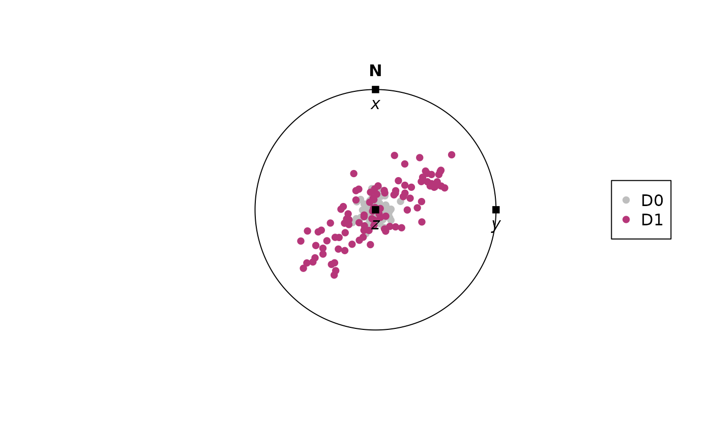

# Deformation and Velocity Gradient Tensor

This tutorial demonstrates how {structr} can be used to deform
orientation data using deformation and velocity gradient tensors. This
can be useful to simulate progressive deformation and change of
orientation. It will also demonstrate how you can combine different
deformation tensors, and how to extract other flow parameters (such as
vorticity, stretching, and dilatation).

``` r
library(structr)
```

## Deformation gradient tensor

3D deformation gradient tensor is a matrix that linearly transforms
points. In other words it describes the changes of points in three
dimensions.

### Define a deformation gradient tensor

The deformation matrix can be defined using several ways:

- `defgrad_by_comp()` creates an defined by individual components
  (default is identity tensor)
- `defgrad_by_ratio()` creates an isochoric tensor with axial stretches
  defined by strain ratios (default is identity tensor).
- [`defgrad_from_vectors()`](https://tobiste.github.io/structr/reference/defgrad.md)
  creates tensor representing rotation around the axis perpendicular to
  both vectors and rotate `v1` to `v2`.
- [`defgrad_from_axisangle()`](https://tobiste.github.io/structr/reference/defgrad.md)
  creates tensor representing a rigid-body rotation about an axis and an
  angle.
- [`defgrad_from_pureshear()`](https://tobiste.github.io/structr/reference/defgrad.md)
  creates an isochoric coaxial tensor.
- [`defgrad_from_simpleshear()`](https://tobiste.github.io/structr/reference/defgrad.md)
  creates an isochoric non-coaxial tensor.
- [`defgrad_from_generalshear()`](https://tobiste.github.io/structr/reference/defgrad.md)
  creates an isochoric tensor, where *transtension* is $k > 1$ and
  $\gamma \neq 0$, and *transpression* is $k < 1$ and $\gamma \neq 0$
  ([¹](#fn1))
- [`defgrad_from_dilation()`](https://tobiste.github.io/structr/reference/defgrad.md)
  creates tensor representing the volume change in z-direction.

``` r
D1 <- defgrad_from_generalshear(k = 2.5, gamma = 0.9)
print(D1)
#> Deformation gradient tensor
#>      [,1]     [,2] [,3]
#> [1,]    1 1.473332  0.0
#> [2,]    0 2.500000  0.0
#> [3,]    0 0.000000  0.4
```

### Matrix algebra

An *isochoric* deformation tensor creates deformation without volume
change. In that case, the determinant of the matrix must be 1. In R,
this can be checked using [`det()`](https://rdrr.io/r/base/det.html):

``` r
det(D1)
#> [1] 1
```

The *inverse* of the tensor reverses the deformation. In R, this can be
done using [`solve()`](https://rdrr.io/r/base/solve.html):

``` r
solve(D1)
#>      [,1]       [,2] [,3]
#> [1,]    1 -0.5893326  0.0
#> [2,]    0  0.4000000  0.0
#> [3,]    0  0.0000000  2.5
```

The *eigenvectors* of the tensor describe the orientation of the strain
ellipse, and the eigenvalues $\lambda$ describe its shape (i.e. length
of the principal axes is proportional to the amount of stretch).

``` r
eigen(D1)
#> eigen() decomposition
#> $values
#> [1] 2.5 1.0 0.4
#> 
#> $vectors
#>           [,1] [,2] [,3]
#> [1,] 0.7007364    1    0
#> [2,] 0.7134203    0    0
#> [3,] 0.0000000    0    1
```

Deformation tensors can be combined using *matrix multiplication*. The
resulting deformation from our general-shear deformation (D1)
superimposed by our rotation (D2) is

``` r
D2 <- defgrad_from_axisangle(Line(0, 90), 30)

D12 <- D2 %*% D1 # D1 is applied first
```

> Matrix multiplication is **not commutative**, i.e.
> $D1 \cdot D2 \neq D2 \cdot D1$

### Transformation using deformation gradient tensor

The deformation can now be applied on some orientation data using linear
transformation:

``` r
# generate some random lineation
xl <- rvmf(100, mu = Line(0, 90), k = 100)

xl_transformed <- transform_linear(xl, D1)
head(xl_transformed)
#> Vector (Vec3) object (n = 6):
#>                x           y         z
#> [1,] -0.10284016  0.04850097 0.3964546
#> [2,]  0.13775532  0.31523476 0.3963421
#> [3,]  0.04318670  0.24232166 0.3961172
#> [4,] -0.12970895 -0.33532970 0.3954535
#> [5,] -0.23446654 -0.31984836 0.3962864
#> [6,] -0.08260559  0.09628880 0.3957975
```

Let’s visualize the deformation:

``` r
# The coordinate axes of our deformation tensor:
axes <- Vec3(c(1, 0, 0), c(0, 1, 0), c(0, 0, 1))

stereoplot(guides = FALSE) # turn off guidelines for better visibility
points(xl, col = "grey", pch = 16)
points(xl_transformed, col = "#B63679FF", pch = 16)
points(axes, pch = 15)
text(axes, labels = c("x", "y", "z"), pos = 1, font = 3)

legend("right", legend = c("D0", "D1"), col = c("grey", "#B63679FF"), pch = 16)
```



## Velocity gradient tensor

The velocity gradient tensor **L** describes the velocity of particles
at any instant during the deformation. Velocity gradient tensor from
deformation gradient tensor.

- The `time` argument specifies the time of deformation, i.e. how many
  times the Deformation gradient tensor should be applied.

``` r
L <- velgrad(D1, time = 10)
```

### Decomposition

The velocity gradient tensor **L** can be decomposed into a symmetric
matrix **S** (the strain rate or stretching tensor) and the
skew-symmetric matrix **W** (the spin tensor).

The stretching matrix (or tensor) and describes the portion of the
deformation that over time produces strain:

``` r
S <- velgrad_rate(L)
```

The spin tensor contains information about the internal rotation during
the deformation:

``` r
W <- velgrad_spin(L)
```

The eigenvectors of the stretching gradient tensor give the orientations
and lengths of the **instantaneous stretching axes**:

``` r
S_eig <- eigen(S)

# ISA vectors
axes_ISA <- S_eig$vectors |>
  as.Vec3() |>
  Line()

# Amounts of stretching
S_eig$values
#> [1]  0.11003269 -0.01840362 -0.09162907
```

> The shortcut functions `instantaneous_stretching_axes(L)` and
> `instantaneous_stretching(L)` produce the same results as above.

The eigenvectors of the velocity gradient tensor describe the **flow
apophyses**:

``` r
L_eig <- eigen(L)

# Flow apophyses
flow_vectors <- L_eig$vectors |>
  t() |>
  as.Vec3()

flow_apophyses <- rbind(
  crossprod(flow_vectors[1, ], flow_vectors[2, ]),
  crossprod(flow_vectors[2, ], flow_vectors[3, ])
) |> Plane()
```

> short cut: `flow_apophyses(L)`

The angle α between the apophyses is directly related to how close to
simple shear or pure shear the deformation is. α is zero for simple
shear and 90° for pure shear. The **kinematic vorticity number** $W_{k}$
is given by $W_{k} = \cos\alpha$:

``` r
alpha <- angle(flow_apophyses[1, ], flow_apophyses[2, ])
abs(cos(alpha * pi / 180))
#> [1] 0.7007364
```

> short cut: `kinematic_vorticity_from_velgrad(L)`

The **vorticity vector** is the eigenvector corresponding to the
intermediate eigenvalue of the velocity gradient tensor:

``` r
Line(flow_vectors[2, ])
#> Line object (n = 1):
#> azimuth  plunge 
#>       0      90
```

> shortcut: `vorticity_vector(L)`

### Strain increments

Now we can extract the deformation gradient tensor accumulated after a
given time. Here we extract the deformation gradient tensors for some
time steps using
[`defgrad()`](https://tobiste.github.io/structr/reference/defgrad.md)

- The `steps` argument specifies how many increments you would like to
  extract (this is also is the “resolution” of the deformation path)
- The `time`

``` r
D1_steps <- defgrad(L, time = 10, steps = 2)
```

Now apply the deformation tensors on some orientation data

``` r
xl_steps <- lapply(D1_steps, function(i) {
  transform_linear(xl, i)
})
```

### Visualization of deformation over time

And plot the paths showing how the orientations change over time

``` r
increments <- seq(0, 10, 2)
cols <- assign_col(increments)

stereoplot(guides = FALSE) # turn off guidelines for better visibility

# plot the strain increments
stereo_path(xl_steps, type = "l")
stereo_path(xl_steps, type = "p", col = cols, pch = 16, cex = .4)

# flow apophyses
lines(flow_apophyses, col = c("grey30", "grey70"), lty = c(1, 2))

# instantaneous stretching axes
points(axes_ISA, pch = 15, col = "#B63679FF")
text(axes_ISA, labels = c("ISA-1", "ISA-2", "ISA-3"), col = "#B63679FF", pos = 3, font = 2)

# coordinate axes of def-tensor
points(axes, pch = 15)
text(axes, labels = c("x", "y", "z"), pos = 1, font = 3)

# legend
legend(0, -1.1,
  xjust = 0.5,
  legend = c("Flow apophysis 1", "Flow apophysis 2"),
  col = c("grey30", "grey70"),
  lty = c(1, 2)
)
legend_col(increments, title = "Time")
```


We can also monitor how the orientation tensor changes during
progressive deformation:

``` r
par(mfrow = c(1, 2))
vollmer_plot(xl_steps, type = "b", col = cols)
hsu_plot(xl_steps, type = "b", col = cols)
```


## References

Fossen, H., & Tikoff, B. (1993). The deformation matrix for simultaneous
simple shearing, pure shearing and volume change, and its application to
transpression-transtension tectonics. Journal of Structural Geology,
15(3–5), 413–422. <https://doi.org/10.1016/0191-8141(93)90137-Y>

Sanderson, D. J., & Marchini, W. R. D. (1984). Transpression. Journal of
Structural Geology, 6(5), 449–458.
<https://doi.org/10.1016/0191-8141(84)90058-0>

------------------------------------------------------------------------

1.  Fossen, H., & Tikoff, B. (1993). The deformation matrix for
    simultaneous simple shearing, pure shearing and volume change, and
    its application to transpression-transtension tectonics. Journal of
    Structural Geology, 15(3–5), 413–422.
    <https://doi.org/10.1016/0191-8141(93)90137-Y>
