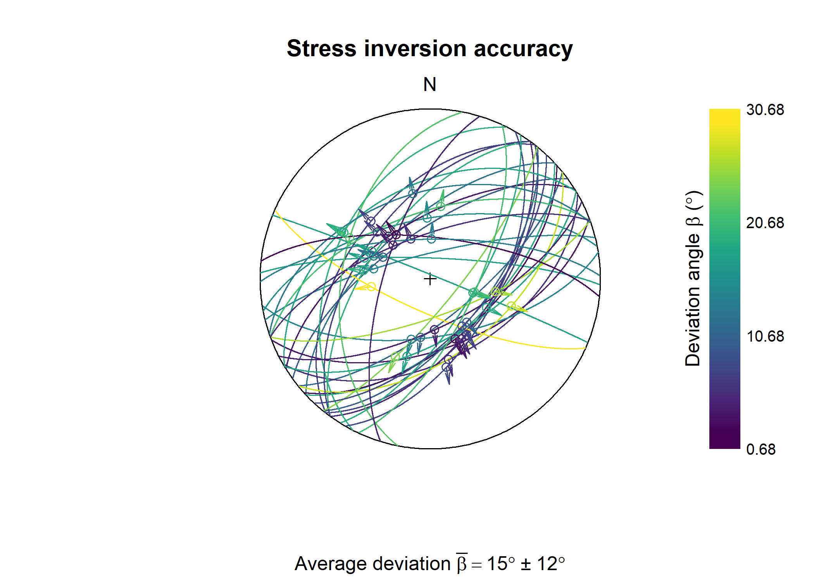
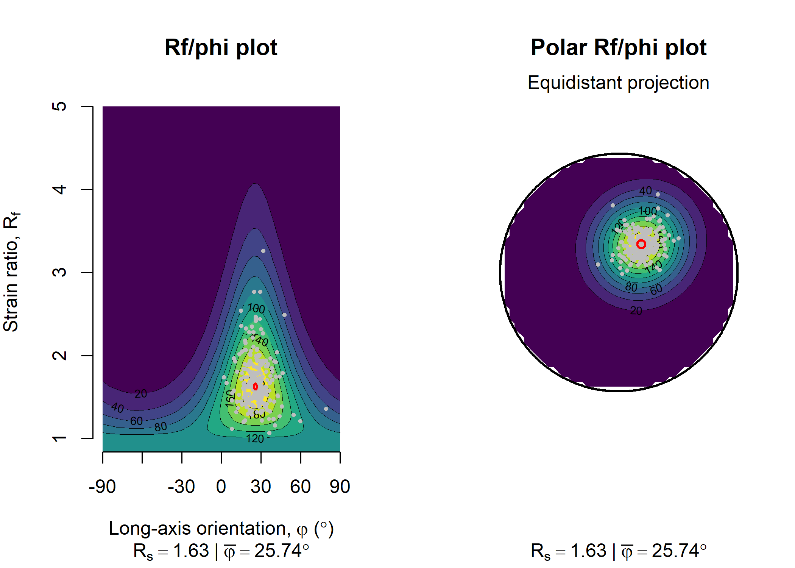
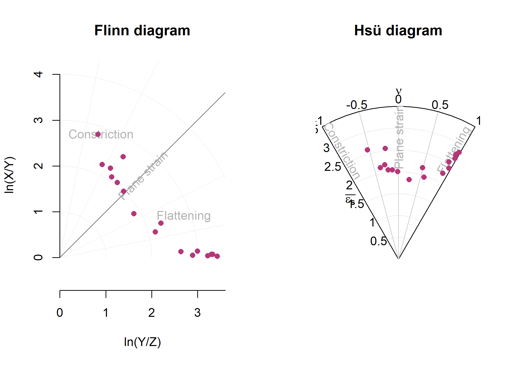

# structr

[structr](https://tobiste.github.io/structr/) is a free and open-source
package for R that provides tools for structural geology. The toolset
includes

- Analysis and visualization of orientation data of structural geology
  (including, **stereographic projections**, contouring, fabric plots,
  and statistics),

- Statistical analysis: spherical mean and variance, confidence regions,
  hypothesis tests, **cluster analysis** of orientation data
  ([`sph_cluster()`](https://tobiste.github.io/structr/reference/sph_cluster.md),
  and geodesic regression to find the **best-fitting great circle or
  small circle** through orientation data
  ([`regression_greatcircle()`](https://tobiste.github.io/structr/reference/best_fit.md)
  and
  [`regression_smallcircle()`](https://tobiste.github.io/structr/reference/best_fit.md)),

- Reconstruction of fabric orientations in **oriented drillcores** by
  transforming the α, β, and γ angles
  ([`drillcore_transformation()`](https://tobiste.github.io/structr/reference/drillcore.md),

- Deform orientation data using deformation and velocity gradient
  tensors:
  [`defgrad()`](https://tobiste.github.io/structr/reference/defgrad.md)
  and
  [`velgrad()`](https://tobiste.github.io/structr/reference/gradient.md)

- **Stress analysis**: reconstruction of stress orientation and
  magnitudes from fault-slip data (stress inversion based on **Michael,
  1984**:
  [`slip_inversion()`](https://tobiste.github.io/structr/reference/slip_inversion.md)),
  extracting the **maximum horizontal stress** of a 3D stress tensor
  ([`SH()`](https://tobiste.github.io/structr/reference/SH.md)), and
  visualization of magnitudes of stress in the **Mohr circle**
  ([`Mohr_plot()`](https://tobiste.github.io/structr/reference/Mohr_plot.md)),

- Calculation fault displacement components,

- Strain analysis (**R**_(f)/ϕ), contouring on the unit hyperboloid,
  **Fry plots** and **Hsu plots**

- Vorticity analysis using the **Rigid Grain Net** method
  ([`RGN_plot()`](https://tobiste.github.io/structr/reference/RGN_plot.md)),
  and

- Direct import of your field data from **StraboSpot** projects
  ([`read_strabo_JSON()`](https://tobiste.github.io/structr/reference/strabo.md)).

> The {structr} package is all about structures in 3D. For analyzing
> orientations in 2D (statistics, rose diagrams, etc.), check out the
> [tectonicr](https://github.com/tobiste/tectonicr) package!

## Duplicate Name Alert

This repository \[structr\] is not associated with the generic
application platform [structr](https://github.com/structr/structr).
Please ensure you are using the correct version to avoid compatibility
issues.

## Installation

You can install the development version of
[structr](https://tobiste.github.io/structr/) from
[GitHub](https://github.com/) with:

``` r
# install.packages("devtools")
devtools::install_github("tobiste/structr")
```

## Documentation

The detailed documentation can be found at
<https://tobiste.github.io/structr/>

## Examples

These are some basic examples which shows you what you can do with
{structr}. First we load the package

``` r
library(structr)
```

### Stereographic and Equal-Area Projection

Plot orientation data in equal-area, lower hemisphere projection:

``` r
# load some example data
data("example_planes")
data("example_lines")

# initialize the stereoplot
stereoplot(
  title = "Lambert equal-area projection",
  sub = "Lower hemisphere",
  ticks = 45, labels = TRUE
)

# add vectors as points
points(example_lines, col = "#B63679", pch = 19, cex = .5)
points(example_planes, col = "#000004", pch = 1, cex = .5)

# add a legend
legend("topright", legend = c("Lines", "Planes"), col = c("#B63679", "#000004"), pch = c(19, 1), cex = 1)
```


### Density on a Sphere

Density shown by contour lines…

``` r
par(mfrow = c(1, 2))
contour(example_planes)
points(example_planes, col = "grey", cex = .5)
title(main = "Planes")

contour(example_lines)
points(example_lines, col = "grey", cex = .5)
title(main = "Lines")
```


or as filled contours:

``` r
par(mfrow = c(1, 2))
image(example_planes)
points(example_planes, col = "grey", cex = .5)
title(main = "Planes")

image(example_lines)
points(example_lines, col = "grey", cex = .5)
title(main = "Lines")
```


### Spherical Statistics

Calculation of arithmetic mean, geodesic mean, confidence cones and
eigenvectors… and plotting them in the equal-area projection:

``` r
planes_mean <- sph_mean(example_planes)
planes_geomean <- geodesic_mean(example_planes)
planes_eig <- ot_eigen(example_planes)$vectors

par(mfrow = c(1, 2), xpd = NA)
stereoplot(title = "Planes", guides = FALSE)
points(example_planes, col = "lightgrey", pch = 1, cex = .5)
lines(planes_eig, col = c("#FB8861FF", "#FEC287FF", "#FCFDBFFF"), lty = 1:3)
points(planes_mean, col = "#B63679", pch = 19, cex = 1)
points(planes_geomean, col = "#E65164FF", pch = 19, cex = 1)
points(planes_eig, col = c("#FB8861FF", "#FEC287FF", "#FCFDBFFF"), pch = 19, cex = 1)
legend(
  0, -1.1,
  xjust = .5,
  legend = c("Arithmetic mean", "Geodesic mean", "Eigen 1", "Eigen 2", "Eigen 3"),
  col = c("#B63679", "#E65164FF", "#FB8861FF", "#FEC287FF", "#FCFDBFFF"),
  pch = 19, lty = c(NA, NA, 1, 2, 3),
  cex = .75
)

lines_mean <- sph_mean(example_lines)
lines_delta <- delta(example_lines)
lines_confangle <- confidence_ellipse(example_lines)

stereoplot(title = "Lines", guides = FALSE)
points(example_lines, col = "lightgrey", pch = 1, cex = .5)
points(lines_mean, col = "#B63679", pch = 19, cex = 1)
stereo_confidence(lines_confangle, col = "#E65164FF")
lines(lines_mean, ang = lines_delta, col = "#FB8861FF")
legend(
  0, -1.1,
  xjust = .5,
  legend = c("Arithmetic mean", "95% confidence cone", "63% data cone"),
  col = c("#B63679", "#E65164FF", "#FB8861FF"),
  pch = c(19, NA, NA), lty = c(NA, 1, 1), cex = .75
)
```


### Orientation Tensor and Fabric Plots

The shape parameters of the orientation tensor of the above examples
planes and lines can be visualized in two ways:

``` r
par(mfrow = c(1, 2), xpd = NA)
vollmer_plot(example_planes, col = "#000004", pch = 16)
vollmer_plot(example_lines, col = "#B63679FF", pch = 16, add = TRUE)

hsu_plot(example_planes, col = "#000004", pch = 16)
hsu_plot(example_lines, col = "#B63679FF", pch = 16, add = TRUE)

legend(
  2.5, -.25,
  xjust = .5, horiz = TRUE, xpd = NA,
  legend = c("Planes", "Lines"), col = c("#000004", "#B63679FF"), pch = 16
)
```


### Best-fit Great- and Small-Circles (Geodesic Regression)

Finds the best-fit great or small-circle for a given set of vectors by
applying geodesic regression:

``` r
set.seed(20250411)
data("gray_example")
cleavage <- gray_example[1:8, ]
bedding <- gray_example[9:16, ]

cleavage_gc <- regression_greatcircle(cleavage)
bedding_gc <- regression_greatcircle(bedding)

cleavage_sc <- regression_smallcircle(cleavage)
bedding_sc <- regression_smallcircle(bedding)

par(mfrow = c(1, 2), xpd = NA)
stereoplot(title = "Best greatcircle", guides = FALSE)
lines(cleavage_gc$vec, col = "#000004FF")
lines(bedding_gc$vec, col = "#B63679")
points(cleavage, col = "#1D1147")
points(bedding, col = "#E65164", pch = 4)

legend(
  0, -1.1,
  xjust = .5,
  col = c("#000004FF", "#B63679"),
  lty = c(1, 1), legend = c("Cleavage greatcircle", "Bedding greatcircle"), bg = "white"
)

stereoplot(title = "Best smallcircle", guides = FALSE)
lines(cleavage_sc$vec, cleavage_sc$cone, col = "#000004FF")
lines(bedding_sc$vec, bedding_sc$cone, col = "#B63679")
points(cleavage, col = "#1D1147")
points(bedding, col = "#E65164", pch = 4)

legend(0, -1.1,
  xjust = .5,
  col = c("#000004FF", "#B63679"), lty = c(1, 1), legend = c("Cleavage smallcircle", "Bedding smallcircle"), bg = "white"
)
```


### Fault Plots

Graphical representation of fault-slip data using Angelier plot (slip
vector on fault plane great circle) and Hoeppener plot (fault slip
vector projected on pole to fault plane):

``` r
data("angelier1990")
faults <- angelier1990$TYM

par(mfrow = c(1, 2))
stereoplot(title = "Angelier plot", guides = FALSE)
angelier(faults, col = "grey20")

stereoplot(title = "Hoeppener plot", guides = FALSE)
hoeppener(faults, points = FALSE, col = "grey20")
```


### Fault-Slip Inversion

Compute deviatoric stress tensor and calculate 95% confidence intervals
using bootstrap samples:

``` r
set.seed(20250411)
faults_stress <- slip_inversion(faults, n_iter = 10)
```

Visualize the slip inversion results (orientation of principal
stresses):

``` r
cols <- c("#000004FF", "#B63679FF", "#FEC287FF")
R_val <- round(faults_stress$R, 2)
R_CI <- round(faults_stress$R_conf, 2)

stereoplot(
  title = "Principal stress axes",
  sub = paste0("Relative stress magnitudes R = ", R_val, " | ", "95% CI: [", R_CI[1], ", ", R_CI[2], "]"),
  guides = FALSE
)
angelier(faults, col = "grey80")
stereo_confidence(faults_stress$principal_axes_conf$sigma1, col = cols[1])
stereo_confidence(faults_stress$principal_axes_conf$sigma2, col = cols[2])
stereo_confidence(faults_stress$principal_axes_conf$sigma3, col = cols[3])
text(faults_stress$principal_axes,
  label = rownames(faults_stress$principal_axes),
  col = cols, adj = -.25
)
```


Visualize the accuracy of the slip inversion by showing the deviation
angle (β) between the theoretical slip and the actual slip vector:

``` r
beta <- faults_stress$fault_data$beta
beta_mean <- round(faults_stress$beta)
beta_CI <- round(faults_stress$beta_CI)

stereoplot(
  title = "Stress inversion accuracy",
  sub = bquote("Average deviation" ~ bar(beta) == .(beta_mean) * degree ~ "\U00B1" ~ .(beta_CI) * degree),
  guides = FALSE
)
angelier(faults, col = assign_col(beta))
legend_col(
  seq(min(beta), max(beta), 10),
  title = bquote("Deviation angle" ~ beta ~ "(" * degree * ")")
)
```



Azimuth of the maximum horizontal stress (in degrees) for the slip
inversion result:

``` r
# Simply call
# faults_stress$SHmax
# faults_stress$SHmax_CI # confidence interval

SH(
  S1 = faults_stress$principal_axes[1, ],
  S2 = faults_stress$principal_axes[2, ],
  S3 = faults_stress$principal_axes[3, ],
  R = faults_stress$R
)
#> [1] 60.80844
```

### Mohr Circle

The Mohr circle for the slip inversion result:

``` r
Mohr_plot(
  sigma1 = faults_stress$principal_vals[1],
  sigma2 = faults_stress$principal_vals[2],
  sigma3 = faults_stress$principal_vals[3],
  unit = NULL, include.zero = FALSE
)
points(faults_stress$fault_data$sigma_n, abs(faults_stress$fault_data$sigma_s),
  col = assign_col(beta), pch = 16
)
```


### Strain Analysis

#### 2D Strain

Aspect ratio of finite strain ellipses vs orientation of long-axis
(Rf/ϕ)

``` r
data(ramsay)

par(mfrow = c(1, 2))
Rphi_plot(r = ramsay[, 1], phi = ramsay[, 2])
elliott_plot(ramsay[, 1], ramsay[, 2], proj = "eqd")
```



#### 3D Strain

Finite strain ellipsoids plotted in Flinn diagram and Hsu diagram:

``` r
data("holst")
R_XY <- holst[, "R_XY"]
R_YZ <- holst[, "R_YZ"]

par(mfrow = c(1, 2))
flinn_plot(cbind(R_XY, R_YZ), log = TRUE, col = "#B63679", pch = 16)
hsu_plot(cbind(R_XY, R_YZ), col = "#B63679", pch = 16)
```



### Vorticity Analysis

Aspect ratio of finite strain ellipses of porphyroclasts vs orientation
of long-axis with respect to foliation plotted in the **Rigid Grain
Net**

``` r
data(shebandowan)
set.seed(20250411)

# Color code porphyroclasts by size of clast (area in log-scale):
RGN_plot(shebandowan$r, shebandowan$phi, col = assign_col(log(shebandowan$area)), pch = 16)
```


### Deformation and Velocity Gradient Tensors

Define a deformation gradient tensor and deform some orientation data
over time `t` in `i` increments:

``` r
# Define deformation time and increments
t <- 10
i <- 2

# Define deformation tensor:
D1 <- defgrad_from_generalshear(k = 2.5, gamma = 0.9)

# Generate some random lineation
xl <- rvmf(100, mu = Line(0, 90), k = 100)

# Generate the velcity gradient tensor for deformation accumulating over time
L <- velgrad(D1, time = t)

# Extract deformation increments
D1_steps <- defgrad(L, time = t, steps = i)

# Transform the lineation for each deformation increment
xl_steps <- lapply(D1_steps, function(i) {
  transform_linear(xl, i)
})

# instantaneous stretching axes
axes_ISA <- instantaneous_stretching_axes(L)

# flow apophyses
flow_apophyses <- flow_apophyses(L)

increments <- seq(0, t, i)

stereoplot(guides = FALSE)
stereo_path(xl_steps, type = "l")
stereo_path(xl_steps, type = "p", col = assign_col(increments), pch = 16, cex = .4)

lines(flow_apophyses, col = c("grey30", "grey70"), lty = c(1, 2))
points(axes_ISA, pch = 15, col = "#B63679FF")
text(axes_ISA, labels = c("ISA-1", "ISA-2", "ISA-3"), col = "#B63679FF", pos = 3, font = 2)

# legend
legend(0, -1.1,
  xjust = 0.5,
  legend = c("Flow apophysis 1", "Flow apophysis 2"),
  col = c("grey30", "grey70"),
  lty = c(1, 2)
)

legend_col(increments, title = "Time")
```

 Show how the orientation
tensor changes during progressive deformation:

``` r
par(mfrow = c(1, 2))
vollmer_plot(xl_steps, type = "b", col = assign_col(increments), pch = 16)
hsu_plot(xl_steps, type = "b", col = assign_col(increments), pch = 16)
```


## Author

Tobias Stephan (<tstephan@lakeheadu.ca>)

## Feedback, issues, and contributions

I welcome feedback, suggestions, issues, and contributions! If you have
found a bug, please file it
[here](https://github.com/tobiste/structr/issues) with minimal code to
reproduce the issue.

## License

MIT License
