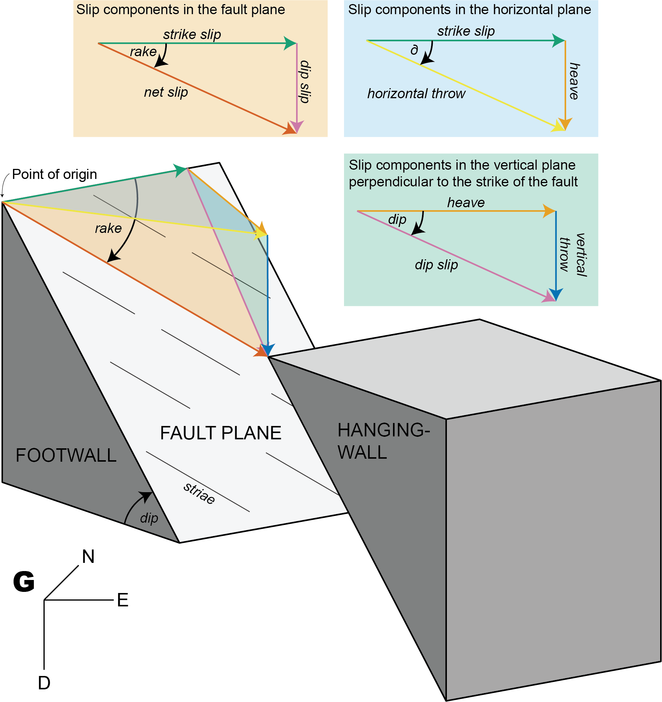

```{r setup, include=FALSE}
knitr::opts_chunk$set(echo = TRUE)
```

# Introduction 

```{r load_functions, include=FALSE}
library("structr")
```

A fault is given by the orientation of its plane (dip direction and dip angle), the orientation of the slip (e.g. measured from striae, given in azimuth and plunge angles), and the sense of displacement:

```{r faults_import}
my_fault <- Fault(120, 50, 60, 110, sense = -1)
```
 > Sense of fault displacement is 1 or -1 for normal or thrust offset, respectively.


Rake of the fault, i.e. the angle between fault slip vector and fault strike:
```{r faults_rake1}
Fault_rake(my_fault)
```
Define a fault by just knowing the orientation of the fault plane, the sense,  and the rake
```{r faults_rake2}
fault_plane <- Plane(c(120, 120, 100), c(60, 60, 50)) # dip direction, dip angle
Fault_from_rake(fault_plane, rake = c(84.7202, -10, 30))
```

Often measured orientation angles can be (slightly) imprecise and subjected to some random noise. Thus the slip vector will not lie (perfectly) on the fault plane, judging by the measurements. To correct the measurements so that this will not be the case:

```{r faults_correct}
p <- Pair(120, 60, 110, 58)
```

```{r faults_correct2}
misfit_pair(p)
```

```{r faults_correct3}
correct_pair(p)
```

> A `"Pair"` object is a container of associated plane and line measurements. Basically like a fault wihtout the sense of displacement.


# Fault stress analysis

Calculates PT-axes, kinematic plane (M), and dihedra separation plane (d):

```{r faults_stress1}
my_fault2 <- Fault(c(120, 120, 100), c(60, 60, 50), c(110, 25, 30), c(58, 9, 23), c(1, -1, 1))
print(my_fault2)
```

```{r faults_stress2}
fault_analysis(my_fault2)
```

# Fault offsets {#sec.offset}

The offset along a fault can be factorized into several components. 

{#id .class width=75% height=75%}

## Get different components with trigonometry
### 1. Input: Fault orientation (dip angle, dip direction), shorteninig direction, and horizontal throw {#sec.offset.1}

Knowing the horizontal throw (e.g. from plate motion parameters), the remaining components of the displacements along a given fault are as follows.

\begin{equation}\delta = |\sigma_{\textrm{Hmax}} - (\textrm{dip direction}+90^{\circ})|\end{equation}

*Slip components in the horizontal plane:*

  \begin{equation}\begin{split}
  f_\textrm{strike slip} & = |\cos{\delta} * f_\textrm{horizontal throw}|\\
  f_\textrm{heave} & = \sqrt{f_\textrm{horizontal throw}^2 - f_\textrm{strike slip}^2}
  \end{split}\end{equation}

*Slip components in the vertical plane perpendicular to the strike of the fault:*

  \begin{equation}\begin{split}
  f_\textrm{dip slip} &=  \frac{f_\textrm{heave}}{cos{(\textrm{dip})}}\\
  f_\textrm{vertical throw} &= \sqrt{f_\textrm{dip slip}^2 - f_\textrm{heave}^2}
  \end{split}\end{equation}

*Slip components in the fault plane plane:*
  
  \begin{equation}\begin{split}
  f_\textrm{net slip} &= \sqrt{f_\textrm{strike slip}^2 + f_\textrm{dip slip}^2}\\
  \textrm{rake} &= \arctan{\left(\frac{f_\textrm{dip slip}}{f_\textrm{strike slip}}\right)}
  \end{split}\end{equation}
  
  Thus, the rake angle describes the ratio between the dip slip and the strike slip component.


Knowing the vertical throw (e.g. from thermochronology or petrology), the fault dip (?assumption), and the direction and amount of horizontal offset, the **strike** of the fault is as follows:

\begin{equation}\begin{split}
f_\textrm{heave} &= f_\textrm{vertical throw} * \tan{(\textrm{dip})}\\
\delta &= \arcsin{\left(\frac{f_\textrm{heave}}{f_\textrm{horizontal throw}}\right)}\\
\textrm{strike} &= |\sigma_{\textrm{Hmax}} - \delta|
\end{split}\end{equation}


Knowing the vertical throw (e.g. from thermochronology or petrology), the fault strike (geomorphology), and the direction and amount of horizontal offset, the **dip** of the fault is as follows:

\begin{equation}\begin{split}
\delta &= |\sigma_{\textrm{Hmax}} - \textrm{strike}|\\
f_\textrm{heave} &= f_\textrm{horizontal throw} * \sin{\delta} \\
\textrm{dip} &= \arctan{\left(\frac{f_\textrm{heave}}{f_\textrm{vertical throw}}\right)} 
\end{split}\end{equation}

Knowing the vertical throw (e.g. from thermochronology or petrology) and the fault's dip and rake, the *horizontal offset*, the horizontal throw, and the net-slip are as follows:


# Fault displacement tensors {#sec.tensors}
Each fault component is a vector describing its direction and length.
For instance, the vector of the strike slip is:

\begin{equation}
  \vec{f_\text{strike slip}} = \begin{pmatrix} \lVert f_\textrm{strike-slip}\rVert \\ 0 \\ 0 \end{pmatrix}
\end{equation}


## Net slip vector {#sec.tensors.netslip}
Net slip vector 

\begin{equation}
  \vec{f_\text{net}} = \begin{pmatrix} \lVert f_\textrm{strike-slip}\rVert \\ \lVert f_\textrm{heave}\rVert \\ \lVert f_\textrm{vertical throw}\rVert \end{pmatrix}
\end{equation}


```{r netslip_vector, eval=FALSE}
fault_displacements(strikeslip = 2, verticalthrow = -5, heave = 3)
```


## Principal displacement tensor {#sec.tensors.principal}
The Eigen values of $\mathsf{F}_{ij}$; represented as $\{ \vec{f_1}, \vec{f_2}, \vec{f_3} \}$ are referred to as the heave, strike slip, and vertical throw component, respectively. These orthonormal vectors define a orthogonal matrix, i.e. the **principal displacement tensor** $\mathsf{F}_\mathbb{F}$:

\begin{equation}\mathsf{F}_{\mathbb{F}} = {\begin{bmatrix} \lVert f_\textrm{heave}\rVert & 0 & 0\\ 0 & \lVert f_\textrm{strike-slip}\rVert & 0\\ 0 & 0 & \lVert f_\textrm{vertical throw}\rVert\end{bmatrix}}\end{equation}

The tensor $\mathsf{F}$ can also be defined by the magnitudes of the fault displacements:

```{r displacement_tensor}
Fu <- fault_tensor(s = 2, v = -5, h = 3)
print(Fu)
```


## Orientation tensor {#sec.tensors.orientation}
Fault orientation tensor is defined by the fault plane's location, orientation (dip direction and dip angle), and the fault's slip (direction and magnitude):

\begin{equation}\mathsf{F}_{ij} = {\begin{bmatrix}f_{11} & f_{12} & f_{13}\\ f_{21} & f_{22} & f_{23}\\ f_{31} & f_{32} & f_{33}\end{bmatrix}}\end{equation} 


```{r ortensor}
Fg <- fault_tensor(s = 2, v = -5, h = 3, dip_direction = 45)
print(Fg)
```


### From Principal displacement tensor to Orientation tensor
Translation point of origin in $\mathsf{F_\mathbb{F}}$ into  point of measurement and rotate into fault orientation $\mathsf{F}_\mathbb{FG}$ 

```{r ftensor_decomp}
fault_tensor_decomposition(Fg, dip_direction = 45)
```


## Stress tensor

> In continuum mechanics, the Cauchy stress tensor $\sigma$, true stress tensor, or simply called the **stress tensor** is a second order tensor named after Augustin-Louis Cauchy. 

The tensor consists of nine components $\sigma_{ij}$ that completely define the state of stress at a point inside a material in the deformed state, placement, or configuration. The tensor relates a unit-length direction vector n to the traction vector $T^{(n)}$ across an imaginary surface perpendicular to n:

\begin{equation} T^{(n)} = n * \sigma \end{equation} or 
\begin{equation} T^{(n)}_j = n_{i}*\sigma_{ij}\end{equation}


# Transformation of the stress tensor
It can be shown that the stress tensor is a contravariant second order tensor, which is a statement of how it transforms under a change of the coordinate system. From an $x_i$-system to an $x_i'$-system, the components $\sigma_{ij}$ in the initial system are transformed into the components $\sigma_{ij}'$ in the new system according to the tensor transformation rule (see Figure 2): 

$\sigma = a_{im} a_{jn} \sigma_{mn}$ or $\sigma' = \mathsf{A} \sigma \mathsf{A}^{T}$,

where $\mathsf{A}$ is a rotation matrix with components $a_{ij}$. In matrix form this is
\begin{equation}
\begin{bmatrix} 
\sigma'_{11} & \sigma'_{12} & \sigma'_{13} \\
\sigma'_{21} & \sigma'_{22} & \sigma'_{23} \\
\sigma'_{31} & \sigma'_{32} & \sigma'_{33}
\end{bmatrix}
=
\begin{bmatrix} 
a_{11} & a_{12} & a_{13} \\
a_{21} & a_{22} & a_{23} \\
a_{31} & a_{32} & a_{33}
\end{bmatrix}
\begin{bmatrix} 
\sigma_{11} & \sigma_{12} & \sigma_{13} \\
\sigma_{21} & \sigma_{22} & \sigma_{23} \\
\sigma_{31} & \sigma_{32} & \sigma_{33}
\end{bmatrix}
\begin{bmatrix} 
a_{11} & a_{12} & a_{13} \\
a_{21} & a_{22} & a_{23} \\
a_{31} & a_{32} & a_{33}
\end{bmatrix}
\end{equation}

{#id .class width=75% height=75%}

Expanding the matrix operation, and simplifying terms using the symmetry of the stress tensor, gives

$\sigma_{11}' = a_{11}^{2}\sigma_{11} + a_{12}^{2}\sigma_{22} + a_{13}^{2}\sigma_{33} + 2a_{11}a_{12}\sigma_{12} + 2a_{11}a_{13}\sigma_{13} + 2a_{12}a_{13}\sigma_{23}$,

$\sigma _{22}'=a_{21}^{2}\sigma _{11}+a_{22}^{2}\sigma _{22}+a_{23}^{2}\sigma _{33}+2a_{21}a_{22}\sigma _{12}+2a_{21}a_{23}\sigma _{13}+2a_{22}a_{23}\sigma _{23}$,

$\sigma _{33}'=a_{31}^{2}\sigma _{11}+a_{32}^{2}\sigma _{22}+a_{33}^{2}\sigma _{33}+2a_{31}a_{32}\sigma _{12}+2a_{31}a_{33}\sigma _{13}+2a_{32}a_{33}\sigma _{23}$,

$\sigma _{12}'=a_{11}a_{21}\sigma _{11}+a_{12}a_{22}\sigma _{22}+a_{13}a_{23}\sigma _{33}+(a_{11}a_{22}+a_{12}a_{21})\sigma _{12}+(a_{12}a_{23}+a_{13}a_{22})\sigma _{23}+(a_{11}a_{23}+a_{13}a_{21})\sigma _{13}$,

$\sigma _{23}'=a_{21}a_{31}\sigma _{11}+a_{22}a_{32}\sigma _{22}+a_{23}a_{33}\sigma _{33}+(a_{21}a_{32}+a_{22}a_{31})\sigma _{12}+(a_{22}a_{33}+a_{23}a_{32})\sigma _{23}+(a_{21}a_{33}+a_{23}a_{31})\sigma _{13}$,

$\sigma _{13}'=a_{11}a_{31}\sigma _{11}+a_{12}a_{32}\sigma _{22}+a_{13}a_{33}\sigma _{33}+(a_{11}a_{32}+a_{12}a_{31})\sigma _{12}+(a_{12}a_{33}+a_{13}a_{32})\sigma _{23}+(a_{11}a_{33}+a_{13}a_{31})\sigma _{13}$.

The *Mohr circle* for stress is a graphical representation of this transformation of stresses. 


## Normal and shear stresses

The magnitude of the normal stress component σn of any stress vector $T(n)$ acting on an arbitrary plane with normal unit vector n at a given point, in terms of the components $\sigma_{ij}$ of the stress tensor $\sigma$, is the dot product of the stress vector and the normal unit vector:

\begin{equation}
\begin{split}
\sigma_\vec{n} & = \mathbf{T}^{(n)}\cdot \vec{n} \\ 
& = T^{(n)}_i n_i \\ 
& =\sigma_{ij} n_i n_j.
\end{split}
\end{equation}


The magnitude of the shear stress component $\tau_n$, acting orthogonal to the vector **n**, can then be found using the Pythagorean theorem:

\begin{equation}
\begin{split}
\tau_{\mathrm {n} }&={\sqrt{\left(T^{(\mathbf{n})}\right)^{2} - \sigma_{\mathrm{n}}^{2}}}\\
&={\sqrt{T_{i}^{(\mathbf{n})}T_{i}^{(\mathbf{n})} - \sigma_{\mathrm{n}}^{2}}},
\end{split}
\end{equation}

where

\begin{equation}{\displaystyle \left(T^{(\mathbf {n} )}\right)^{2}=T_{i}^{(\mathbf {n} )}T_{i}^{(\mathbf {n} )}=\left(\sigma _{ij}n_{j}\right)\left(\sigma _{ik}n_{k}\right)=\sigma _{ij}\sigma _{ik}n_{j}n_{k}}.\end{equation}

## Principal stress
At every point in a stressed body there are at least three planes, called principal planes, with normal vectors $\vec{n}$, called principal directions, where the corresponding stress vector is perpendicular to the plane, i.e., parallel or in the same direction as the normal vector $\vec{n}$, and where there are no normal shear stresses${\displaystyle \tau _{\vec{n}}}$. The three stresses normal to these principal planes are called principal stresses.

The components $\sigma _{ij}$ of the stress tensor depend on the orientation of the coordinate system at the point under consideration. However, the stress tensor itself is a physical quantity and as such, it is independent of the coordinate system chosen to represent it. There are certain invariants associated with every tensor which are also independent of the coordinate system. For example, a vector is a simple tensor of rank one. In three dimensions, it has three components. The value of these components will depend on the coordinate system chosen to represent the vector, but the magnitude of the vector is a physical quantity (a scalar) and is independent of the Cartesian coordinate system chosen to represent the vector (so long as it is normal). Similarly, every second rank tensor (such as the stress and the strain tensors) has three independent invariant quantities associated with it. One set of such invariants are the principal stresses of the stress tensor, which are just the eigenvalues of the stress tensor. Their direction vectors are the principal directions or eigenvectors.

A stress vector parallel to the normal unit vector $\vec{n}$ is given by: 

\begin{equation}
  \mathbf{T}^{(n)} = \lambda \vec{n} = \mathbf{\sigma}_{n}\vec{n}
\end{equation}

where $\lambda$ is a constant of proportionality, and in this particular case corresponds to the magnitudes $\sigma_{n}$ of the normal stress vectors or principal stresses. 


A coordinate system with axes oriented to the principal directions implies that the normal stresses are the principal stresses and the stress tensor is represented by a diagonal matrix:

\begin{equation}
  \sigma_{ij}={\begin{bmatrix}\sigma_{1}&0&0\\0&\sigma_{2}&0\\0&0&\sigma_{3}\end{bmatrix}}
\end{equation}

The principal stresses can be combined to form the stress invariants, $I_{1}$, $I_{2}$, and $I_{3}$. The first and third invariant are the trace and determinant respectively, of the stress tensor. Thus,

\begin{equation} 
\begin{split}
  I_{1} & = \sigma_{1}+\sigma_{2}+\sigma_{3}\\
  I_{2} & = \sigma_{1}\sigma_{2}+\sigma_{2}\sigma_{3}+\sigma_{3}\sigma_{1}\\
  I_{3} & = \sigma_{1}\sigma_{2}\sigma_{3}
  \end{split}
\end{equation} 


Because of its simplicity, the principal coordinate system is often useful when considering the state of the elastic medium at a particular point. Principal stresses are often expressed in the following equation for evaluating stresses in the x and y directions or axial and bending stresses on a part.
The principal normal stresses can then be used to calculate the von Mises stress and ultimately the safety factor and margin of safety.

\begin{equation}
  \sigma_{1},\sigma_{2}={\frac {\sigma_{x}+\sigma_{y}}{2}}\pm {\sqrt {\left({\frac {\sigma_{x}-\sigma_{y}}{2}}\right)^{2}+\tau_{xy}^{2}}}
\end{equation}

Using just the part of the equation under the square root is equal to the maximum and minimum shear stress for plus and minus. This is shown as:

\begin{equation}
  \tau_{\max },\tau_{\min }=\pm {\sqrt {\left({\frac {\sigma_{x}-\sigma_{y}}{2}}\right)^{2}+\tau_{xy}^{2}}}
\end{equation}


## Stress deviator tensor
The stress tensor $\sigma_{ij}$ can be expressed as the sum of two other stress tensors:

*    a mean *hydrostatic stress* tensor or volumetric stress tensor or mean normal stress tensor, $\pi \delta_{ij}$, which tends to change the volume of the stressed body; and
*    a deviatoric component called the stress deviator tensor, $s_{ij}$, which tends to distort it.

So

\begin{equation}   \sigma_{ij} = s_{ij} + \pi \delta_{ij}, \end{equation}

where $\pi$ is the mean stress given by

\begin{equation} \pi ={\frac {\sigma_{kk}}{3}}={\frac{\sigma_{11}+\sigma _{22}+\sigma_{33}}{3}}={\frac {1}{3}}I_{1}, \end{equation}

Pressure ($p$) is generally defined as negative one-third the trace of the stress tensor minus any stress the divergence of the velocity contributes with, i.e.

\begin{equation} p=\lambda \,\nabla \cdot {\vec {u}}-\pi =\lambda \,{\frac {\partial u_{k}}{\partial x_{k}}}-\pi =\sum_{k}\lambda \,{\frac {\partial u_{k}}{\partial x_{k}}}-\pi, \end{equation}

where $\lambda$ is a proportionality constant, $\nabla$ is the divergence operator, $x_{k}$ is the k:th Cartesian coordinate, $\vec{u}$ is the velocity and $u_{k}$ is the k:th Cartesian component of $\vec{u}$.

The deviatoric stress tensor can be obtained by subtracting the hydrostatic stress tensor from the Cauchy stress tensor:

\begin{equation}
\begin{split}

s_{ij} & = \sigma_{ij} - {\frac {\sigma_{kk}}{3}}\delta_{ij},\\

\begin{bmatrix}s_{11}&s_{12}&s_{13}\\s_{21}&s_{22}&s_{23}\\s_{31}&s_{32}&s_{33}\end{bmatrix} & = \begin{bmatrix}\sigma_{11}&\sigma_{12}&\sigma_{13}\\\sigma_{21}&\sigma_{22}&\sigma_{23}\\\sigma_{31}&\sigma_{32}&\sigma_{33}\end{bmatrix} - \begin{bmatrix}\pi &0&0\\0&\pi &0\\0&0&\pi \end{bmatrix}\\
& = \begin{bmatrix}\sigma_{11}-\pi &\sigma_{12}&\sigma_{13}\\\sigma_{21}&\sigma_{22}-\pi &\sigma_{23}\\\sigma_{31}&\sigma_{32}&\sigma_{33}-\pi \end{bmatrix}.
\end{split}
\end{equation}


## Maximum horizontal stress[^ref2]
[^ref2]: Lund & Townend (2007): Calculating horizontal stress orientations with full or partial
knowledge of the tectonic stress tensor. *Geophys. J. Int.*, 170, 1328—1335. doi: 10.1111/j.1365-246X.2007.03468.x

We de fine a vertical plane in the geographic coordinate system, $\mathbb{G}$, using its unit normal vector, $\vec{n}^T_\mathbb{G} = (n_N, n_E, n_D) = (\cos\alpha, \sin\alpha, 0)$, where $\alpha$ is the normal’s trend angle measured clockwise from north and the plane’s strike is $\alpha+\pi/2$. We represent $\vec{n}$ with respect to the principal stress coordinate system using the transformation matrix

\begin{equation}
\mathsf{A}_{\mathbb{S}\mathbb{G}} = \begin{pmatrix}
\vec{\sigma}_1 \vec{g}_1 & \vec{\sigma}_1 \vec{g}_2 & \vec{\sigma}_1 \vec{g}_3 \\
\vec{\sigma}_2 \vec{g}_1 & \vec{\sigma}_2 \vec{g}_2 & \vec{\sigma}_2 \vec{g}_3 \\
\vec{\sigma}_3 \vec{g}_1 & \vec{\sigma}_3 \vec{g}_2 & \vec{\sigma}_3 \vec{g}_3 \\
\end{pmatrix}
\end{equation}

(i.e. $a_{ij} = \sigma_i g_j$). Here $\sigma_i = (\sigma_{iN}, \sigma_{iE}, \sigma_{iD})$ are unit vectors in the
principal stress directions (principal stress coordinate system $\mathbb{S}$ with unit vectors $\{ \mathbf{\vec{\sigma_1}}, \mathbf{\vec{\sigma_2}}, \mathbf{\vec{\sigma_3}} \}$) with respect to the geographic coordinate system ($\mathbb{G}$), and $\vec{g_1} = (1,0,0)$, $\vec{g_2} =(0,1,0)$ and $\vec{g_3} = (0,0,1)$ are the basis vectors in the geographic coordinate system. The normal vector expressed with respect to the principal stress system is then

\begin{equation}
\vec{\mathbf{n}}_\mathbb{S} = \mathsf{A}_{\mathbb{S}\mathbb{G}}\vec{\mathbf{n}}_\mathbb{G} = \begin{pmatrix}
\sigma_{1N}n_N + \sigma_{1E}n_E\\
\sigma_{2N}n_N + \sigma_{2E}n_E\\
\sigma_{3N}n_N + \sigma_{3E}n_E
\end{pmatrix},
\end{equation}

where, for example, $\sigma_{1N}$ is the north component of the $\vec{\sigma}_1$ unit vector.
In the principal coordinate system, the stress tensor is diagonal

\begin{equation}
\mathsf{S}_\mathbb{S} = 
\begin{pmatrix} 
\lVert \sigma_1 \rVert & 0 & 0 \\
0 & \lVert\sigma_2\rVert & 0 \\
0 & 0 & \lVert\sigma_3\rVert
\end{pmatrix}
\end{equation}

and the normal stress acting on the vertical plane of interest is

\begin{equation}
\begin{split}
\sigma_n &= \left( \mathbf{\vec{n}}^T_\mathbb{S} \mathsf{S}_\mathbb{S} \mathbf{\vec{n}}_\mathbb{S} \right)\\
 &= \left[ 
  \lVert\sigma_1\rVert ( \sigma_{1N}n_N + \sigma_{1E}n_E )^2 +
  \lVert\sigma_2\rVert ( \sigma_{2N}n_N + \sigma_{2E}n_E )^2 +
 \lVert\sigma_3\rVert (\sigma_{3N}n_N + \sigma_{3E}n_E)^2 
 \right] \mathbf{\vec{n}}_{\mathbb{S}}\\
 &= \lVert\sigma_n\rVert \mathbf{\vec{n}}_\mathbb{S}.
\end{split}
\end{equation}

This normal stress corresponds to the horizontal stress in the direction of $\mathbf{\vec{n}}$.


We can find the direction of the maximum horizontal stress analytically by differentiating the last equation with respect to $\alpha$.

\begin{equation}
\frac{d\sigma_n}{d\alpha} = \left[
\lVert\sigma_1\rVert ( \sigma_{1E}^2 - \sigma_{1N}^2 ) + 
\lVert\sigma_2\rVert ( \sigma_{2E}^2 - \sigma_{2N}^2 ) +
\lVert\sigma_3\rVert ( \sigma_{3E}^2 - \sigma_{3N}^2 )
\right] \sin{2\alpha} + 
2 \left[\lVert\sigma_1\rVert \sigma_{1N} \sigma_{1E} + \lVert\sigma_2\rVert \sigma_{2N} \sigma_{2E} + \lVert\sigma_3\rVert \sigma_{3N} \sigma_{3E} \right] \cos{2\alpha}.
\end{equation}


Condition  |   Interpretation
--- | ---
    $\sigma_{1N} = \pm \sigma_{1E}$ and $R = 1$  |   $\mathbb{S}_H$ undefined if $\mathbf{\vec{\sigma_1}}$ vertical, else $\alpha_H = \alpha_1$ (45$^{\circ}$ or 135$^{\circ}$)        
    $\sigma_{1N} = \pm \sigma_{1E}$ and $\sigma_{2N} = \pm \sigma_{2E}$  |   $\mathbb{S}_H$ undefined if $R = 0$, else $\alpha_H = \alpha_1$ (45$^{\circ}$ or 135$^{\circ})        
    $(\sigma_{1N}^2 - \sigma_{1E}^2) + (1 - R)(\sigma_{2N}^2 - \sigma_{2E}^2) = 0$  |   $\mathbb{S}_H$ undefined if $R = 0$, else $\alpha_H = \alpha_1$ (45$^{\circ}$ or 135$^{\circ})


Table: Table 1 Summary of the conditions under which the denominator of eq. (11) equals zero. $\alpha_H$ and $\alpha_1$ denote the trends of the axis of maximum horizontal stress, $\sigma_H$, and the principal axis of maximum compressive stress, $\mathbf{\vec{\sigma_1}}$, respectively.

In general (cf. Table 1), $\sigma_n$ has one maximum and one minimum in the interval $0 \leq \alpha \leq \pi$ and setting the derivative in the last equation to zero, we find these stationary points:

\begin{equation}
\tan{2\alpha} = \frac{
2 ( \lVert\sigma_1\rVert \sigma_{1N} \sigma_{1E} + \lVert\sigma_2\rVert \sigma_{2N} \sigma_{2E} + \lVert\sigma_3\rVert \sigma_{3N} \sigma_{3E} )}{\lVert\sigma_1\rVert ( \sigma_{1E}^2 - \sigma_{1N}^2 ) + 
\lVert\sigma_2\rVert ( \sigma_{2E}^2 - \sigma_{2N}^2 ) +
\lVert\sigma_3\rVert ( \sigma_{3E}^2 - \sigma_{3N}^2 )}.
\end{equation}

Using the second derivative of $\sigma_n$ with respect to $\alpha$ we can determine whether $\sigma_n (\alpha)$ yields a maximum or a minimum value, and identify the $\sigma_H$ trend ($\alpha_H$) accordingly:

\begin{equation}
\alpha_H = 
\begin{cases}
\alpha & \text{if $\lVert\sigma_n (\alpha)\rVert$ is a maximum} \\
\alpha + \pi/2 & \text{if $\lVert\sigma_n (\alpha)\rVert$ is a minimum} 
\end{cases}.
\end{equation}


### Code

Define the orientation of the principle stress axes:
```{r lund0}
S1 <- Line(250.89, 70.07)
S3 <- Line(103.01, 17.07)
```

To get S2 - which is perpendicular to S1 and S3, we calculate the cross-product of the two vectors:
```{r lund01}
S2 <- crossprod(S3, S1)
```

The azimuth of SHmax for a given stress ratio `R = 1`:
```{r lund1}
SH(S1, S2, S3, R = 1) # in degrees
```

For a several stress ratios:
```{r lund2}
R <- seq(0, 1, .1)
cbind(R, SH = SH(S1, S2, S3, R = R))
```


# Mountain building and earthquakes: Some simple geometrical calculations

Suppose we wish to compute how long it will take for 3000 meters (roughly 10,000 feet) of uplift to occur. Clearly, the time it requires is equal to the uplift ($v=f_{\text{vertical throw}}$) divided by the rate at which uplift occurs $\dot{v} = \frac{\delta f_{\text{vertical throw})}}{\delta t}$.

\begin{equation} t_{\text{v}} = \frac{|v|}{\dot{v}} \end{equation}

To compute how horizontal strain $\varepsilon$ that accumulates at a known rate ($\dot{\varepsilon} = 5\,\text{m} / 200\,\text{ys}$ in this example) translates into vertical uplift rate $\dot{v}$, we note that it is related to the tangent of the dip of the fault ($\beta$) as follows

\begin{equation}
  \dot{v} = \dot{h} * \tan{\beta}
\end{equation}
where

\begin{equation}
 \dot{h} = \frac{d_\text{earthquake}}{\Delta t_\text{earthquake}}
\end{equation}

$d_\text{earthquake}$  is the slip during average earthquake; $\Delta t_\text{earthquake}$ is the earthquake recurrence interval.

Suppose that uplift occurs along a shallow fault dipping 10 degrees from horizontal. Then,

\begin{equation}
 t_{v} = \frac{3\,000\,\text{m}}{5\,\text{m} / 200\,\text{yr}} * \tan{10^{\circ}} = 680\,000\,\text{yr}
\end{equation}

For a steeper fault ($30^{\circ}$), uplift of $3\,000 \text{m}$ occurs even more rapidly, in only $210\,000\,\text{yr}$.

Thus, for rapid convergence rates and even shallow fault dips, significant topographic relief can appear in only several hundred thousand years - a geological instant! Of course, these calculations ignore the important effects of erosion and downward flexure of the lithosphere under the load of a growing mountain, both of which slow the rate at which a mountain can grow. We shall consider these effects more in future lectures.


---

# Abbreviations and symbols
Two coordinate systems are of importance here: a principal stress coordinate system, $\mathbb{S}$, with unit vectors $\{ \vec{\sigma_1},\vec{\sigma_2},\vec{\sigma_3} \}$ aligned along the eigenvectors whose eigenvalues are $\{ \lVert\sigma_1\rVert,\lVert\sigma_2\rVert, \lVert\sigma_3\rVert  \}$, respectively; and a geographic coordinate system, $\mathbb{G}$, with unit vectors $\{\vec{g_1}, \vec{g_2}, \vec{g_3} \}$ aligned with the north, east and down directions, respectively.
In this paper, matrices are represented in sans serif upper-case letters (e.g. $\mathsf{S}$), vectors in bold lower-case letters (e.g. $\mathbf{n}$), and vector magnitudes in upper-case italics (e.g. $S_n = \lVert \mathbf{s}_n \rVert$; Table 2). 
The components of matrices and vectors are represented, for example, as $s_{ij}$ and $n_i$, respectively, and a caret and subscript (e.g. $\mathbf{\vec{s_i}}$ ) are used together to denote the ith unit basis vector of a coordinate system ($i = 1, 2, 3$). Vector orientations are expressed in terms of trend and plunge angles as trend/plunge (e.g. 135/25). 
For convenience, we use upper-case bold symbols for the two most frequently used 
parameters, namely the vectors of maximum horizontal stress $S_H$ and its proxy $S_P$.


Symbol | Explanation
--- | ---
$\alpha$ |  Arbitrary trend angle measured clockwise from north
$\alpha_H$ | Trend of the maximum horizontal compressive stress
$\alpha_P$ | Trend of the maximum horizontal stress proxy
$\mathsf{A}_{\mathbb{XY}}$ | Rotation matrix between coordinate systems $\mathbb{Y}$ and $\mathbb{X}$
$\beta$ | fault dip angle
$\mathsf{D}$ | Deviatoric stress tensor (with respect to $S_3\mathsf{I}$)
$\mathbf{d}_n$ | Deviatoric normal stress vector
$D_n$ |  Magnitude of the deviatoric normal stress vector
$\mathsf{F}$ | Fault displacement tensor
$f_i$ | Fault displacement component
$\dot{f_i} = {\Delta f_i}/{\Delta t}$ | Rate of fault displacement, i.e. displacement over time 
$\vec{g}_i$ | Axes of the north-east—down coordinate system $\mathbb{G}$
$\mathsf{I}$ | Identity matrix
$\mathbf{\vec{n}}_{\mathbb{X}}$ | Unit normal vector represented in coordinate system $\mathbb{X}$
$n_i$  | Components of the vector $\mathbf{n}$
$R$  | Stress ratio equal to $(S_1 −S_2)/(S_1 −S_3)$
$\mathsf{S}$ | Stress tensor
$\mathbf{S_H}$ | Maximum horizontal compressive stress vector
$\mathbf{\vec{\sigma}_i}$ | Axes of the principal stress coordinate system $\mathbb{S}$
$\sigma_{ij}$ | Components of matrix $\mathsf{S}$ (i.e. the $j$th component of $\vec{s_i}$ )
$\mathbf{\sigma_n}$ | Normal stress vector
$S_n = \lVert \sigma_n \rVert$  | Magnitude of the normal stress vector
$\mathbf{S}_P = \mathbf{\sigma}_P$ | Maximum horizontal stress proxy vector
$S_i = \lVert \sigma_i \rVert$ | Magnitudes of the principal stresses $(S_1 \geq S_2 \geq S_3)$
$t$ | Time
$\Delta t = |t_2 - t_1|$ | Time interval
$\mathbb{X}$ | Arbitrary coordinate system

Table: Table 2 Mathematical symbols. Indices $i$ and $j$ each span the range 1, 2, 3,
and an arrow ($\vec{.}$) denotes a unit vector.


# References
